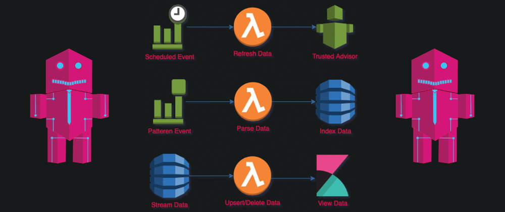

I wanted to share this open source project that I recently contributed to github called [automated-cloud-advisor](https://github.com/disneystreaming/automated-cloud-advisor).

<!-- truncate -->

> Automated Cloud Advisor is an extensible tool that aims at facilitating cost optimization in AWS, by collecting data for resources that are under utilized. In addition, this is a great learning tool for new DevOps/Cloud engineers that want to start automating things in AWS.
The tool is deployed as a set of cloudformation stacks that comprise the data collection and the data can be displayed in a Kibana dashboard.

You can also checkout the installation documentation at [disneystreaming.github.io](https://disneystreaming.github.io/automated-cloud-advisor/).