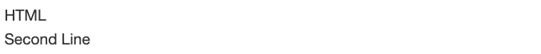
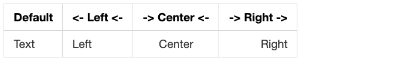
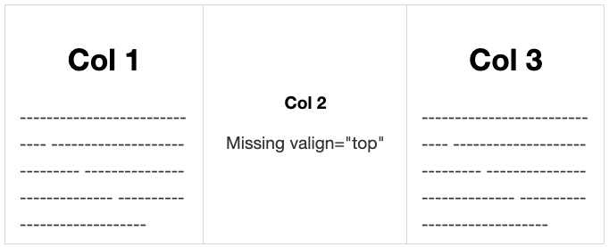

# Styling Tips for README

Markdown has limited styling, but you can leverage some HTML for a better viewing experience on a Github repository.

<!-- truncate -->

## Line Break

#### Markdown


```
3 Empty Spaces`   `
Second line
```

#### HTML



```
HTML</br>Second Line
```

## Allign

##### Markdown



```
| Default | <- Left <- | -> Center <- | -> Right -> |
| ------- | :--------- | :----------: | ----------: |
| Text    | Left       | Center       | Right       |
```

##### HTML


```
<p>Left</p>
```


```
<p align="center">Center</p>
```


```
<p align="right">Right</p>
```


```
<a></a> <a></a>
```



```
<table>
<tr>
<td valign="top" width="33%">
<h2 align="center">Col 1</h2>
-----------------------------
-----------------------------
-----------------------------
-----------------------------
</td>
<td width="34%">
<h5 align="center">Col 2</h5>
<p align="center">Missing valign="top"</p>
</td>
<td valign="top" width="33%">
<h2 align="center">Col 3</h2>
-----------------------------
-----------------------------
-----------------------------
-----------------------------
</td>
</tr>
</table>
```