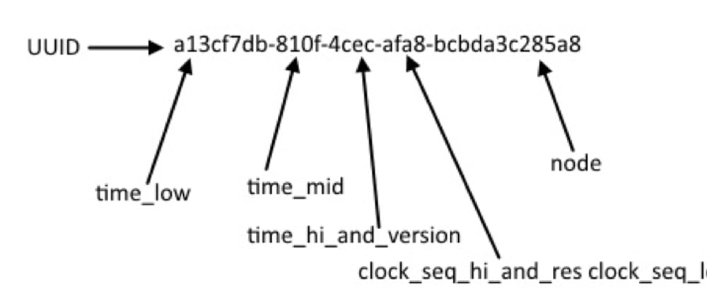

# Which UUID version?

`Universally Unique IDentifiers` versions are defined by the [RFC4122](https://www.ietf.org/rfc/rfc4122.txt).

They are 5 different versions that have different implementations to generate Unique Identifiers.

<!-- truncate -->

<table>
<tr>
<td valign="top" width="20%">
<h4 align="center">v1 Time</h4>

Uses the CPU clock cycle to calculate a unique ID
</td>
<td valign="top" width="20%">
<h4 align="center">v2 MAC</h4>

Uses the CPU clock cycle and MAC address to generate a unique ID.
</td>
<td valign="top" width="20%">
<h4 align="center">v3 MD5</h4>

Uses a namespace value to salt the MD5 Hash (128 bits).
</td>
<td valign="top" width="20%">
<h4 align="center">v4 Random</h4>

Uses Pseudo-random numbers to generate a unique ID.
</td>
<td valign="top" width="20%">
<h4 align="center">v5 SHA-1</h4>

Uses a namespace value to salt the SHA-1 Hash (160 bits).
</td>
</tr>
</table>

## API

Generally, a UUID library will expose all 5 versions and a few helper functions.

- Version: Provides UUID RFC version
- Parse: Convert UUID string to array of bytes
- Stringify: Convert array of bytes to UUID string
- Validate: Check if UUID is valid
- Nil: All bits are set to `0`
  - 00000000-0000-0000-0000-000000000000

## Ranking

<table>
<tr>
<td valign="top" width="50%">
<h4 align="center">Uniqueness</h4>
<h5 align="center">v1 👊 v2 👊 v4</h5>
<h2 align="center">v4 Random</h2>

v1 and v2 are similar, but the cpu cycle is predictable.
</td>
<td valign="top" width="50%">
<h4 align="center">Hashing</h4>
<h5 align="center">v3 👊 v5</h5>
<h2 align="center">v5 SHA-1</h2>

v5 SHA-1 has a stronger encryption than v3 MD5.
</td>
</tr>
<tr>
<td valign="top" width="50%">
<h4 align="center">Protected</h4>
<h5 align="center">v2 👊 v1 👊 v4 👊 v3 👊 v5</h5>
<h2 align="center">v5 SHA-1</h2>

v1 and v2 are similar, but the MAC address can make your system less secure.
</td>
<td valign="top" width="50%">
<h4 align="center">Overall</h4>
<h5 align="center">v1 👊 v2 👊 v3 👊 v5 👊 v4</h5>
<h2 align="center">v4 Random</h2>

v4 is generally the best option in most use cases.
</td>
</tr>
</table>
