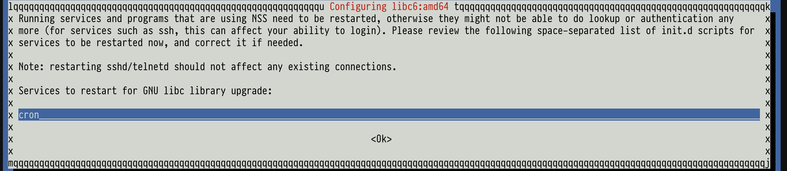
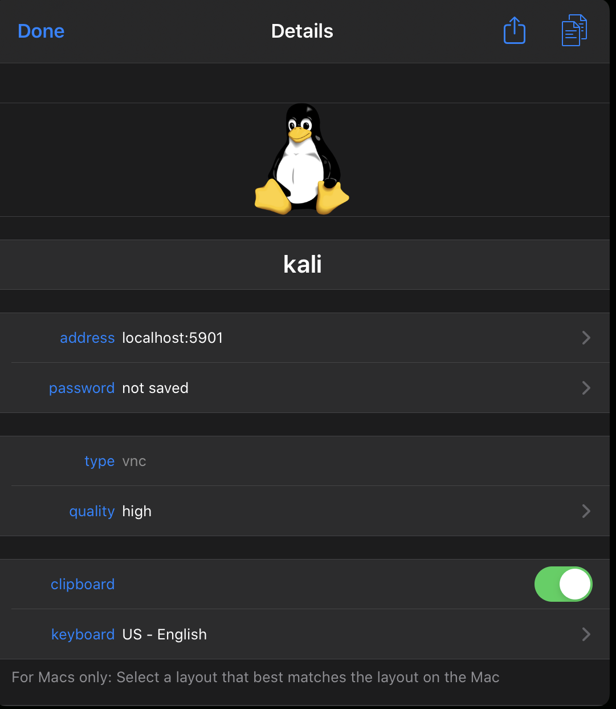

This guide will go over how to run a virtual instance of Kali Linux on your iPad using a two iPad applications and provisioning a server on [Digital Ocean](https://m.do.co/c/c4eedf7f7c5c)

<!-- truncate -->

|    |   |   |
|----|---|---|
|1. [Blink](#blink-ssh-key)|2. [Digital Ocean](#digital-ocean-server)|3. [Mosh](#mosh)|
|4. [Kali](#kali)|5. [VNC](#vnc)|6. [JumpDesktop](#jumpdesktop)|

## Cost

|    |SSH|VNC|Kali|
|----|---|---|---|
|Port|22|5900|22|
|Site |[Blink](https://blink.sh/)|[JumpDesktop](https://www.jumpdesktop.com/)|[Digital Ocean](https://m.do.co/c/c4eedf7f7c5c)|
|Cost|$19.99|$14.99|-|
|Cost Per Month|-|-|$15.00|


### Blink SSH Key

```
# Use blink to create a SSH key
ssh-keygen -t rsa -b 4096 -C “your@email.com”

# Copy public key
cat ~/.ssh/id_rsa.pub | pbcopy

# Copy private key
cat ~/.ssh/id_rsa | pbcopy
```

### [Digital Ocean](https://m.do.co/c/c4eedf7f7c5c) Server

Choose `Debian 9` for the OS


Choose Basic plan `$15.00/mo` so that you can properly install the OS without errors


Choose Datacenter


Add SSH key from the previous blink step


Get IPv4 address


### Mosh

[mosh](https://mosh.org) is like ssh, but allows intermittent connections

#### Host


Click on `Hosts`


Enter the hostname values and use the SSH key that you created in the previous steps


#### Install

```
# Log into your host with ssh2
ssh2 kali

# Update and install mosh
apt-get update -y & apt-get install -y mosh

# Log out of your host
exit

# Log into your host with mosh going forward
mosh kali
```

### Kali

#### Setup Source

```
# Update source.lists by adding kali reference
echo "deb http://http.kali.org/kali kali-rolling main contrib non-free" >> /etc/apt/sources.list

# Update
apt-get update -y
```

You will get this error if you do not have permission

```
W: GPG error: http://kali.mirror.garr.it/mirrors/kali kali-rolling InRelease: The following signatures couldn't be verified because the public key is not available:
  NO_PUBKEY ED444FF07D80BF6
E: The repository 'http://kali.mirror.garr.it/mirrors/kali kali-rolling InRelease' is not signed.
N: Updating from such a repository can't be done securely, and is therefore disabled by default.
N: See apt-secure(8) manpage for repository creation and user configuration details.
```

```
# Fix Error
apt-get -y --allow-unauthenticated install kali-archive-keyring

# Re-run update
apt-get update -y

# Search for Kali installation
apt-cache search kali-linux
```


#### Install

```
# Install everything, which will be larger than 25GB
apt-get -y install kali-linux-everything
```

You will be prompted a few questions during the installation

Select Language


Install Samba


Enable Packet Capture


Enable Mac Changer


Kismet is a resource hog, but can be turned off with
`systemctl stop kismet`


Add user


Standalone


Restart services after installation


Restart services



Use sshd config


#### Validate

##### Cleanup

```
# Finalize/cleanup Linux Kernel
apt-get -y update
apt-get -y upgrade
apt-get -y dist-upgrade
apt-get -y autoremove

# Restart
shutdown now -rf
```

##### Check Kernel

```
uname -r
```


### VNC

#### Enable [SSH Port Local Forwarding](https://www.ssh.com/ssh/tunneling/example)

- VNC is very insecure because the traffic is sent over an insecure connection
  - Unencrypted connection that can be sniffed
- SSH Port Local Forwarding creates an encrypted session over port 22
  - [Reverse proxy](https://www.cloudflare.com/learning/cdn/glossary/reverse-proxy/) the connection to localhost:5901

```
# Enable TCP forwarding
nano /etc/ssh/sshd_config

############ START OF FILE ############
AllowTcpForwarding yes
############ END OF FILE ############

# Restart SSH
systemctl restart sshd

# Check status
systemctl status sshd
```

#### Install

- This startup script will enable a VNC server that listens on localhost for SSH Port Local Forwarding
- The password will be used to login through VNC

```
# Install tight vnc server
apt-get install -y tightvncserver

# Create start up script
nano /etc/init.d/tightvncserver

############ START OF FILE ############
#!/bin/sh

USER=root
HOME=/root
export USER HOME

case "$1" in
 start)
   echo "Starting VNC Server"
   /usr/bin/vncserver :1 -geometry 1280x1024 -depth 16 -localhost -nolisten tcp
   ;;

 stop)
   echo "Stopping VNC Server"
   /usr/bin/vncserver -kill :1
   ;;

 *)
   echo "Usage: /etc/init.d/vncboot {start|stop}"
   exit 1
   ;;
esac

exit 0
############ END OF FILE ############

# Update the permission
chmod +x /etc/init.d/tightvncserver

# Update defaults
update-rc.d tightvncserver defaults

# Configure password
tightvncserver

# Restart
shutdown now -rf
```

#### Validate

```
# Verify that VNC is listening on localhost or 127.0.0.1 and port 5901
netstat -tupln | grep vnc
```


### JumpDesktop

Set the hostname as `localhost` or `127.0.0.1` and the port as `5901`


Edit


Add SSH Tunneling


Add sever by adding the IPv4 address from [Digital Ocean](https://m.do.co/c/c4eedf7f7c5c)


You will need to either copy and paste or load iTunes and store the key in the jump desktop app


Add the private key


Update the icon and title



Enable SSH


Enter VNC password that you created in the previous step


Interact with GUI


