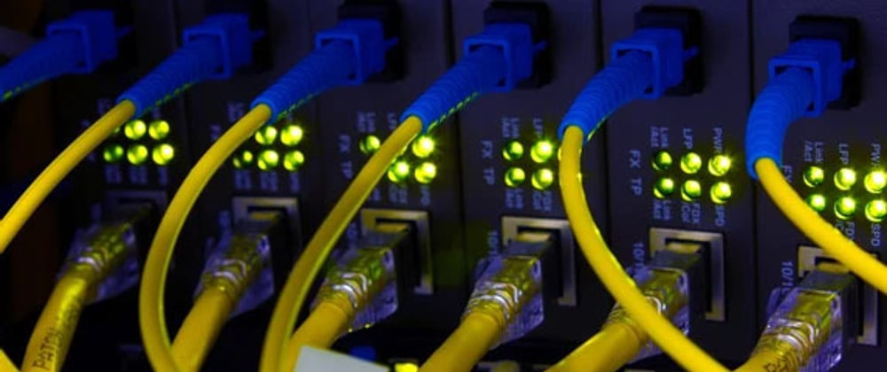

|  |  |  |
|:-|:-|:-|
|[1. Identify the Problem](#1-identify-the-problem)|[2. Develop a Theory](#2-develop-a-theory)|[3. Test the Theory](#3-test-the-theory)|
|[4. Plan of Action](#4-plan-of-action)|[5. Implement the Solution](#5-implement-the-solution)|[6. Verify System Functionality](#6-verify-system-functionality)|
||[7. Document the Issue](#7-document-the-issue)||

<!-- truncate -->

I wanted to hard wire all of my devices on my Local Area Network using Ethernet. I noticed one of my connections was much slower than expected and wanted to fix it. This write up goes over the 7 steps that a network administrator should use to troubleshoot network issues.

| Terms            | Definition  |
| ---------------- | ----------- |
| Fast Ethernet    | 100 Megabits per second  |
| Gigabit Ethernet | 1000 Megabits per second |
| Half Duplex      | Transmit data in one direction at a time |
| Full Duplex      | Transmit data in two directions at the same time |
| ISP              | Internet Service Provider |
| VPN              | Virtual Private Network   |
| WAN              | Wide Area Network         |
| LAN              | Local Area Network        |

# 1. Identify the Problem

- [TP-Link 5 Port Gigabit Switch] identifies port as `100 Mbps Full duplex`

- [fast.com] test shows 92 Mbps

# 2. Develop a Theory

- [Cat5e] cable is damaged or misconfigured

# 3. Test the Theory

- Use another wire and connection

# 4. Plan of Action

- Fix [Cat5e] Ethernet with a [Network Tool Kit]

- Update Male [Cat5e] Ethernet Jack

- Update Female [Ethernet Keystone Jack]

# 5. Implement the Solution

## Update [Cat5e] Ethernet Jack

- Use crimping tool 

- Cut Male [Cat5e] Ethernet jack

- Expose Wires

- Inspect wiring arrangement

- Use wire stripping knife

- Cut covering

- Remove covering

- Separate wire pairing

- Insert wires into RJ45

- Tighten wires with crimping tool RJ45 slot 

## Update [Ethernet Keystone Jack]

- Use Punchdown tool

- Push down into Female [Ethernet Keystone Jack] and trim exposed wires

- Use B layout

- Use B layout

- Install on wall plate

# 6. Verify System Functionality

- [TP-Link 5 Port Gigabit Switch] identifies port as `1000 Mbps Full duplex`

- [fast.com] test shows 220 Mbps
- In theory, I should get higher speed if I purchase more bandwidth from my ISP

# 7. Document the Issue

This write up is the documentation and is intended for sharing on the public internet

[TP-Link 5 Port Gigabit Switch]: https://a.co/d/ak0LMJt
[fast.com]: https://fast.com/
[Cat5e]: https://a.co/d/271M8AH
[Network Tool Kit]: https://a.co/d/3aFyMJh
[Ethernet Keystone Jack]: https://a.co/d/248yeLW