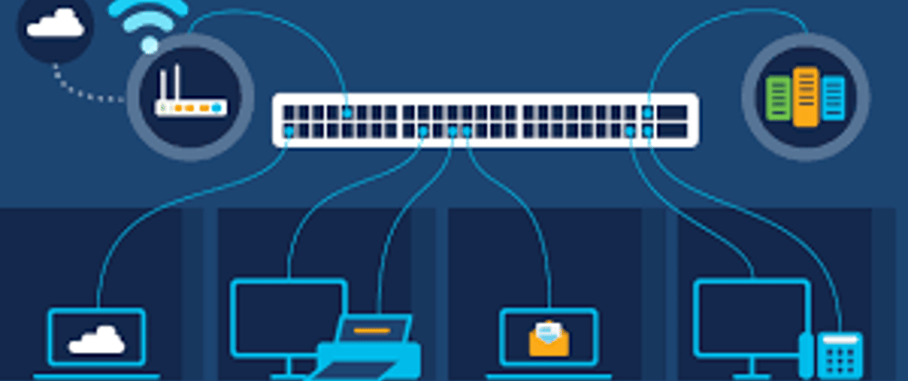

| [Why](#why)| [What](#what) | [How](#how)|
|-|-|-|
|1. [Infrastructure](#infra)|2. [Administrator](#admin)        |3. [Game](#game)|
|4. [Laboratory](#lab)|5. [Internet of Things](#iot)|6. [Network Attachment Storage](#nas)|
|7. [Dematerialized Zone](#dmz)|8. [Work](#work)|9. [Guest](#guest)|

<!-- truncate -->

## Why

Having all devices on the same network introduces risk and network congestion. Physically separating devices onto subnets and then bridging them together is complex. Virtual Local Area Networks (VLANs) provide a way to keep all devices on the same physical network, but will logically isolate traffic.

You wouldn’t let strangers take a squat in your home so why should you let rouge devices on your network? Properly identifying which device is who and what are they doing is important to reduce risks. Each device can be identified by it’s Media Access Control (MAC) address and be assigned a static Internet Protocol (IP) address and hostname. You can easily spoof these, but this is a layer in the defense in depth strategy. 

Your firewall will identify VLANs through interfaces and can be used to quickly filter and debug network issues. Grouping devices together into an interface will reduce broadcasts and improve network traffic by splitting into separate lanes [802.1P]. Each interface will have its own firewall rules on ingress and egress traffic. 

There are many risks introduced when using a single Local Area Network (LAN), but here are a few examples.

| Attack  | Risk |
| :-      | :-   |
| Traffic Sniffing | Unencrypted traffic can be read |
| On Path | Man in the middle can be passive or malicious |
| DNS/ARP Poisoning | Corrupted data on important network protocols |
| Internet of Things (IOT) | Devices that have weak security or rouge services |

[802.1P]: https://en.wikipedia.org/wiki/IEEE_P802.1p

## What

[802.1Q] is known as VLAN tagging. Which adds a VLAN ID tag on the data frame. When moving across the network, this frame is tagged and untagged.

Be aware of VLAN hopping attacks, this can be achieved by misconfigured VLAN tables and adding additional VLAN tags on the data frame, but the data can not return in this situation.


- [networkacademy.io]

[networkacademy.io]: https://www.networkacademy.io/ccna/ethernet/trunk-native-vlan
[802.1Q]: https://en.wikipedia.org/wiki/IEEE_802.1Q
 
## How

The goal of this guide is to learn about different types of networks by building the example network architecture using open source software.

When following this guide, you should work on ONE network at a time. Be patient, patch to latest version of software/firmware, use different web browsers, use commands (ping, ssh, netstat, route), read logs, and restart devices as a last resort.

### Physical and Logical Network Diagram


- 14 Networks
  - 1 WAN
  - 1 LAN
  - 8 VLANs
  - 4 PANs
- 4.5 Wireless Frequencies
  - 5.0 GHz Wifi
  - 2.4 GHz Wifi + ZigBee Channel
  - 2.45 GHz Bluetooth
  - 300 GHz Infrared

### INFRA


This is your most critical network because it will logically separate your network. You should put physical safeguards on these devices. You can achieve this by storing in a secure location, disabling unused port, and applying MAC address allow lists.

### ADMIN


This network should be limited to an administrator who will build, monitor, debug, test, and fix the network.

The admin's access should still be limited to a few ports. You can do most task over Ping, HTTP(S), and SSH (SSH Tunneling).

Bluetooth devices such as wireless headphones will create a Personal Area Network (PAN).

### GAME


You want to take advantage of prioritizing networks by moving this network to a lower priority using quality of service [802.1P].

Bluetooth controllers are on PAN with the consoles. Infrared remotes also create a PAN with the receiver. 

### LAB


This network is physically separated over a distance between four switches. You should have a laboratory (dev) network to test on before making changes on other networks.

### IOT


IOT devices should be on 2.4 GHz, since they do not need high data caps and to lower broadcast interference. In addition, these devices can have poor security and can be exploited.


- 2.4 GHz
- [metageek.com]

[ZigBee] is using the 2.4 GHz frequency, but has multiple channels that overlap Wifi channels. This frequency should be placed on a channel that won't get overpowered from wifi devices.


- ZigBee
- [metageek.com]

[metageek.com]: https://www.metageek.com/training/resources/zigbee-wifi-coexistence/
[ZigBee]: https://en.wikipedia.org/wiki/Zigbee

### NAS


Data is your Gold (Network Attached Storage (NAS)), so it need to be protected. This is a private network, meaning it has no access to any network, including the internet. Only a few devices should have access to the data ports. To perform updates on the system and software, you can forward proxy the requests through a NAT using filtered allow list of endpoints.

### DMZ


There are many ways to connect to a dematerialized zone (DMZ) a.k.a screened subnet and one wrong misconfiguration can be disastrous.

This type of network is open to the WAN (Internet). This can be used when you want to host a website, file server, or VPN concentrator.

### WORK


Sometimes you need to work from home and you should avoid mixing network traffic with your personal network. Your work network should be connected to your works network through a VPN.

### GUEST


Guests will need access to your internet, so having a wifi only connection will serve this purpose.

You can send all egress WAN (Internet) traffic through a VPN. So that you can provide them privacy and prevent your IP address from being associated with their network activity.

## Installation

| [firewall](#firewall) | [dns](#dns) | [siem](#siem) | [wap](#wap) | [TL-1](#tplink-switch) | [TL-2](#tplink-switch) | [TL-3](#tplink-switch)  |
|-|-|-|-|-|-|-|
|10.0.1.1|10.0.1.2|10.0.1.3|10.0.1.4|10.0.1.11|10.0.1.12|10.0.1.13|

### firewall

| | 10.0.1.1 | |
|-|-|-|
| 1. [Specs](#firewall-specs) | 2. [Config](#general-config) | 3. [VLANs](#vlans) |
| 4. [Interfaces](#interfaces) | 5. [DHCP](#dynamic-host-configuration-protocol) | 6. [Aliases](#aliases) |
| 7. [Rules](#firewall-rules) | 8. [Log](#firewall-logs) | 9. [Diagnostics](#diagnostics) |

#### firewall Specs

| Software: [pfSense] | | | | Hardware: [Protectli Vault]  |
| :- | :- | :- | :- | :- |
| Quad Core | 2 Switch Port | AES-NI | 8GB RAM | 120GB mSATA SSD |

- There are many hardware alternatives
- You can also run pfSense on a virtual environment

[pfSense]: https://www.pfsense.org/download/
[Protectli Vault]: https://a.co/d/3Cb1V0C

#### General Config

You should already have pfSense installed and configured on your Local Area Network (LAN) and connected to a Wide Area Network (WAN).


- Click General Setup


- Add your local DNS


- Save

#### VLANs

Add your VLANs with a priority and ID.


- Click Interfaces/Assignments


- Add VLANs


- Add Interfaces

#### Interfaces

You will do this for each interface.


- Edit Interface


- Save


- Apply

#### Dynamic Host Configuration Protocol

You will need to do this for each interface. This protocol will assign IP address for each VLAN.


- Click Services/DHCP Server


- Enable Dynamic Host Configuration Protocol (DHCP)


- Add DNS


- Use MAC address to assign static IP and hostname


- Save

#### Aliases

These are used to point to more one or more devices on the the network. These can be edited and applied across all firewall rules.


- Click Firewall/Aliases


- Add IPs


- Add Ports


- Save

#### Firewall Rules

Rules are stateful (Ingress traffic will be able to return egress traffic with out any rules), read from top to bottom, and have a implicit deny.


- Click Firewall/Rules

##### WAN Rules

Wide Area Network (WAN) is used to connect to remote networks over your ISP or VPN connection.


- Block Everything by using the implicit deny 

##### Floating Rules

These can be applied across multiple interfaces that share the same logic. The alternative is to add ingress and egress rules for all VLANs, which is prone to errors.

The LAN internal traffic will allow the ADMIN_HOSTS to perform debugging tasks on the LAN by using these protocols (PING, SSH, HTTP, HTTPS). In addition, all LANS on the network will have access to these protocols (DNS, NTP, SYSLOG), which are on the INFRA LAN.

The LAN Egress traffic is set to WAN only. The NAS interface does not have this rule because the data on this network needs to be tightly locked down.


- Add Floating Rules

##### Infra Rules

Anti-Lock is added by default to prevent from being locked out. The SIEM (Security Information Event Management) host will be the only host on the entire network to connect to the NAS network Data Ports.


- Add rule with aliases

##### NAS Rules


- Add Rules

##### Route Table

You can run this command on the firewall `netstat -nWr` to see the route table on the firewall.


- Save

#### Firewall Logs

For short term log viewing, you can view from status


- Click Status/System Logs


- Add Filter

For long term log viewing, you can send to a SIEM.


- Click Status/System Logs


- Enable


- Add SIEM
- Save

#### Diagnostics

Use these services to help troubleshoot.


- Click Diagnostics


- Type Host IP to see active connections


- Filter on interface


- Restart if all else fails

### dns

| 10.0.1.2 |
|-|
| 1. [Specs](#dns-specs) |
| 2. [Software](#dns-software)

#### DNS Specs

| Software: [dietpi] | | | | Hardware: [raspberry Pi 3B+]  |
| :- | :- | :- | :- | :- |
| Quad Core | 1 ETH Port  | 4 USB | 1GB RAM | 32GB Micro SD |

[dietpi]: https://dietpi.com/#download
[raspberry Pi 3B+]: https://a.co/d/cl3msmi

#### DNS Software

You can either use a remote DNS servers, but your network will need to make a round trip through the WAN. Local DNS can cache, provide insights on your requests, and filter out request with DNS sink.


- [pi-hole](https://pi-hole.net)


- [Adguard](https://ubuntu.com/appliance/adguard/raspberry-pi
)

### siem

| 10.0.1.3 |
|-|
| 1. [Specs](#siem-specs) |
| 2. [Software](#siem-software)

#### SIEM Specs

| Software: [macOS] | | | | Hardware: [Mac Mini M1]  |
| :- | :- | :- | :- | :- |
| 8 Core | 1 ETH Port  | 4 USB | 16 GB RAM | 256 SSD |

[macOS]: https://www.apple.com/macos/ventura/
[Mac Mini M1]: https://a.co/d/608Y3Zu

#### Siem Software

This device will collect logs and metrics from the network and use this data to trigger events. There's a lot on this topic, so I do a separate write up and update at a later point.

##### [GrayLog]

[GrayLog]: https://go2docs.graylog.org/5-0/downloading_and_installing_graylog/docker_installation.htm

Using docker compose you can run a local installation of the application. 

```yml
version: '3'
services:
  # MongoDB: https://hub.docker.com/_/mongo/
  mongo:
    image: mongo:5.0.13
    networks:
      - graylog
  # Elasticsearch: https://www.elastic.co/guide/en/elasticsearch/reference/7.10/docker.html
  elasticsearch:
    image: docker.elastic.co/elasticsearch/elasticsearch-oss:7.10.2
    environment:
    - http.host=0.0.0.0
    - transport.host=localhost
    - network.host=0.0.0.0
    - "ES_JAVA_OPTS=-Dlog4j2.formatMsgNoLookups=true -Xms512m -Xmx512m"
    ulimits:
      memlock:
        soft: -1
        hard: -1
    deploy:
      resources:
        limits:
         memory: 1g
    networks:
      - graylog
  # Graylog: https://hub.docker.com/r/graylog/graylog/
  graylog:
    image: graylog/graylog:5.0
    environment:
      # CHANGE ME (must be at least 16 characters)!
      - GRAYLOG_PASSWORD_SECRET=somepasswordpepper
      # Password: admin
      - GRAYLOG_ROOT_PASSWORD_SHA2=8c6976e5b5410415bde908bd4dee15dfb167a9c873fc4bb8a81f6f2ab448a918
      - GRAYLOG_HTTP_EXTERNAL_URI=http://127.0.0.1:9000/
    entrypoint: /usr/bin/tini -- wait-for-it elasticsearch:9200 --  /docker-entrypoint.sh
    networks:
      - graylog
    restart: always
    depends_on:
      - mongo
      - elasticsearch
    ports:
      # Graylog web interface and REST API
      - 9000:9000
      # Syslog TCP
      - 514:514
      # Syslog UDP
      - 514:514/udp
      # GELF TCP
      - 12201:12201
      # GELF UDP
      - 12201:12201/udp

networks:
  graylog:
    driver: bridge
```


- Add input


- Syslog


- Port 514

##### [Grafana]

[Grafana]: https://grafana.com/grafana/dashboards/5420-pfsense-graylog/


- Use Graylog data to visualize on dashboard

##### [Wireshark]

[Wireshark]: https://www.wireshark.org/#download

Use this for packet capturing on a particular interface.


### wap

| | 10.0.1.4 | | 
|-|-|-|
| 1. [Specs](#wap-specs) | 2. [Administration](#administration) | 3. [Config](#basic-config) |
| 4. [Services](#wap-services) | 5. [Wireless](#wap-wireless) | 6. [Security](#wap-security) |
| 7. [VLAN](#wap-vlan) | 8. [Networking](#wap-networking) | 9. [Debug](#wap-debug) |

Make sure you are on the latest firmware to enable this feature. Use Firefox or chrome.

There are 2 different frequencies to understand.

##### 5.0 GHZ

Provide higher speeds, has multiple channels to use, and radio waves dissipate in shorter distances. 

##### 2.4 GHZ

Can provide reasonable speeds for IOT devices, has 3 usable channels in the USA, and radio waves can travel further distances.

#### wap Specs

| Software: [dd-wrt] | | | | Hardware: [linksys wrt3200acm]  |
| :- | :- | :- | :- | :- |
| Dual Core | 4 Switch Port  | 2 USB | 802.11a/b/g/n/ac | 4 Dual-Band Antennas |

- There are many hardware alternatives
- The WAN port will be untagging the INFRA network to access admin console
- The LAN port will be carrying the tagged traffic
- Once VLANS are set up, you can remove WAN port and plug into LAN

[dd-wrt]: https://download1.dd-wrt.com/dd-wrtv2/downloads/betas/
[linksys wrt3200acm]: https://a.co/d/9bAPfvt

#### Administration


- Click Administration/Management


- Enable Protocols


- Save

#### Basic Config


- Click Setup/Basic Setup


- Disable WAN


- Assign IP information
- Disable DHCP


- Save

#### wap Services


- Click Services/Services


- Disable Services


- Enable SSH


- Enable Syslog


- Save

#### wap Wireless

Your wireless connection might be different.


- Click Wireless/Basic Setting


- Add 5.0 GHZ Virtual Access Points


- Add 2.4 GHZ Virtual Access Points


- Disable Mixed Connection


- Save

#### wap Security


- Click Wireless/Wireless Security


- Set Mode


- Save

#### wap VLAN

You will need to use 2 ports on wap (WAN and LAN) when configuring your VLANs. You can use one, but you will be unplug and plug between these interfaces. Once configuration is complete you will only need to connect LAN port, but you will lose access to the router console.


- Click Setup/Switch Config


- Configure your VLAN Table


- Save

#### wap Networking


- Click Setup/Networking


- Add Bridges and map to your VLANs


- Save

#### wap Debug

Use the SIEM to read SYSlogs and Wireshark to analyze traffic


- Reboot if all fails

### [TPLink Switch]
[TpLink Switch]: https://a.co/d/aK6GsXL

These switch help expand the network by carrying VLAN IDs. You will enable VLANS and set PVIDs through the admin console.


- 802.1Q


- Enable


- Use when a port needs to be untagged and allow DHCP to assign IPs for that VLAN


### TL-1

#### 10.0.1.11


- VLAN Table


- PVID

### TL-2

#### 10.0.1.12


- VLAN Table


- PVID

### TL-3

#### 10.0.1.13


- VLAN Table


- PVID
