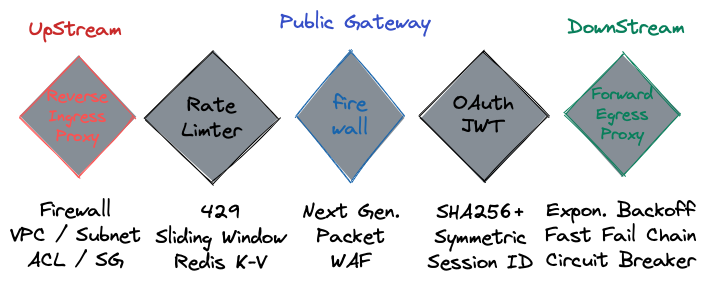
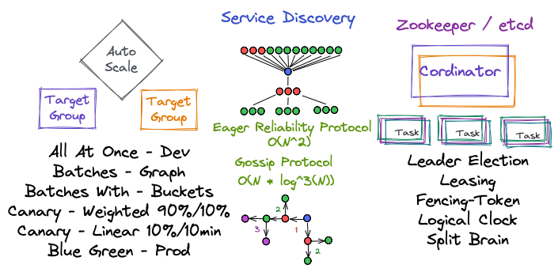

A high level break down of key components when doing a system design problem.

| [Requirements](#requirements)| [Estimations](#estimations) | [Network](#network) | [Application](#application) | [Database](#database) |
| - | - | - | - | - |
| [Functional](#functional) | [Calculations](#calculations) | [WAN](#wide-area-network) | [Load Balancer](#load-balancer) | [SQL](#sql) |
| [Non-Functional](#non-functional) | [QPS](#qps) | [Payload](#payload) | [Service Discovery](#service-discovery) | [NoSQL](#nosql) |
| [Architecture](#architecture) | [Max QPS](#max-qps) | [Gateway](#public-gateway) | [Consensus](#consensus) | [CAP PACELC](#cap-pacelc) |
| [Key Performance Indicators](#key-performance-indicators) | [Storage Bytes](#storage-bytes) | [VPC](#virtual-private-cloud) | [Compute](#compute) | [Partition](#partition) |
| - | [Retention Bytes](#retention-bytes) | - | [Message Queue](#message-queue) | [Index](#index) |
| - | [In E Gress Bytes](#in-e-gress-bytes) | - | [Cache](#cache) | [ACID](#acid) |

<!-- truncate -->

## Requirements

Get requirements and estimations to scope your system design.

### Functional

Identity what you are trying to build.
 
| Features    | System        |
| ----------- | ------------- |
| 1 on 1 chat | Mobile/Web    |
| News feed   | Notifications |

### Non Functional

Identify how your system will behave.

| User Experience            | System            |
| -------------------------- | ----------------- |
| Full end to end encryption | High Availability |
| See new post fast          | Reliability       |

### Architecture

- High Availability
- Failover

- Reliability
- RPO/RTO

### Key Performance Indicators 

- Observability
- Metrics

## Estimations

| Value | Number | Byte |
| - | - | - |
| Hundred | - | B |
| Thousand | K | KB |
| Million  | M | MB |
| Billion  | B | GB |
| Trillion | T | TB |
| Quadrillion | Q | PB |
| Quintillion | Qu | EB |
| Sextillion | S | ZB |
| Septillion | Se | YB |

Estimate the scope of your users and data points.

| Users (DAU)       | File Type (File Bytes) | Storage (Retention Time) |
| ----------------- | ---------------------- | -------- |
| 100 B Message/day | 1 KB (avg)               | 10 years |
| 10 B Post/day     | 10 KB (max)              | 10% new data per year |

### Calculations

Using your estimations do some back of envelope.

| [QPS](#qps) | [Max QPS](#max-qps) | [Storage-Bytes](#storage-bytes) | [Retention Bytes](#retention-bytes) | [In/E Gress Bytes](#in-e-gress-bytes)|
| ----------- | ------------------- | - | - | - |
| DAU / ~100K | 2 * QPS             | DAU * FileBytes   | StorageBytes * Retention Time | (QPS * FileBytes) / 8 Bit |

#### QPS

- Queries Per Second
- Daily Active Users
- Time = Round up (86,400 seconds in day)

#### Max QPS

- Double Queries Per Second
- Calculate (Read % : Write %) Ratio
  - 1 Read : 10 Write
  - Read %  = 1  * Queries Per Second
  - Write % = 10 * Queries Per Second

#### Storage Bytes

- Storage Bytes
- Daily Active Users
- File Bytes

#### Retention Bytes

- Retention Bytes
- Storage Bytes
- Retention Time
  - 365 days in year

#### In E Gress Bytes

- In-gress
- E-gress
- 1 Byte / 8 Bits
- Queries Per Second
- File Bytes

## Network

### Wide Area Network

- Clients
  - Mobile
  - Browser
  - CLI
- DNS
  - DNSSec (Signed Registries)
  - DNS over HTTPS (Privacy)
- CDN
- APN

### Payload

- API
- Request Lines
- Authentication/Authorization
- Protocols

### Public Gateway

- Firewall
- Rate Limiter
- Authentication/Authorization
- Reverse Proxy
- Forward Proxy

### Virtual Private Cloud

- Access Control List
- Security Group
- Route Table
- Classless Inter-Domain Routing
- Gateway
  - Internet
  - Network Adress Translation
  - VPC Peering

## Application

### Load Balancer

- Layer 3/4/7 OSI
- Strategy
- Use cases

### Service Discovery

- Auto Scale
  - DevOps
- Protocols
- Zeekeeper/etcd

### Consensus

- Raft Consensus
- Replicated State Machine

### Compute

- Session(less)
- State(full)/(less)
- Server(less)

### Message Queue

- Producer
- Consumer

### Cache

- Eviction Strategy

## Database

### SQL

- Relational Data
- Transactions

### NoSQL

- Key Value
- Document
- Wide Column
- Graph
- TimeSeries
- Spatial

### CAP PACELC

- CAP
  - Consistency
  - Availability
  - Partition
- PACELC
  - Partition == true
      - IF
  - Availability
      - or
  - Consistency
      - ELSE
  - Latency
      - or
  - Consistency

### Partition

- Consistent Hashing
- Range Partition
- Vertical Partition

### Index

- B Tree
- Skip List
- Hash
- Inverted

### ACID

#### Atomicity

- Transactions
- Rollbacks

#### Consistency

##### SQL Consistency

- Schema
- Constraint
- Fan Trap

##### NoSQL Consistency

- Eventual Consistency
- Sequential Consistency
- Strong Consistency

- Strong Eventual Consistency
- Quorum Replication
- (Dotted) Vector Clocks
- Chain Replication

#### Isolation

- Race Conditions
- Lock
- Concurrency

#### Durability

- High Watermark
- Checkpoint
- Write Ahead Log