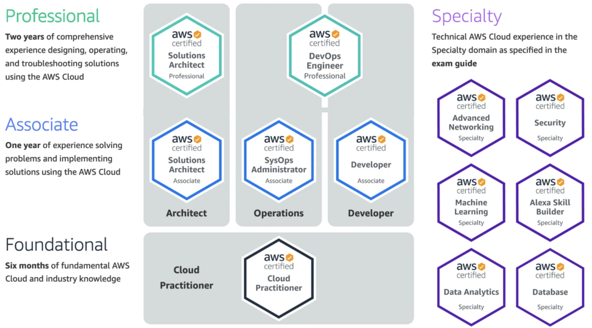

I recently went on a certification binge to get 12 certs in 5 months (Nov/4/23 - Apr/20/22). Below are some strategies to stack multiple certifications to stack your resume and LinkedIn profile.

|[Scrum](#scrum) |[AWS](#aws)|[CompTIA](#comptia)|
|:-:|:-:|:-:|
|[resources](#scrum-resources)|[resources](#aws-resources)|[resources](#comptia-resources)|

<!-- truncate -->

## Scrum

### ScrumMaster

> Foundation -> Advanced -> Professional -> Elevated

### Developer

> Foundation -> Advanced -> Professional

### Product Owner

> Foundation -> Advanced -> Professional

My journey started back in 2016 when I first got my `Certified ScrumMaster` certification through [scrumalliance.org]. The certification needs to be renewed before the two-year renewal date. Typically, I would obtain the scrum education units ([SEU]) and pay the renewal fee. However, in late 2020, I wanted to pick up a new `Scrum Developer` certification. I plan on getting `Product Owner` and then moving onto the `Advanced` level where the certs start to stack on renewal.

### Scrum Resources

- [scrumalliance.org]
- [SEU]

[scrumalliance.org]: https://www.scrumalliance.org/
[SEU]: https://www.scrumalliance.org/get-certified/scrum-education-units

## AWS

### DevOps

> Cloud Practitioner -> Developer Associate -> DevOps Engineer Professional

> Cloud Practitioner -> SysOps Administrator Associate -> DevOps Engineer Professional

### Solution Architect

> Cloud Practitioner -> Solutions Architect Associate -> Solutions Architect Professional

### Speciality

> Speciality

I skipped the `Cloud Practitioner` and plan on taking the `Speciality` certs at some point. I had already taken the three `Associate` and two `Professional` certifications through [aws.amazon.com] in early 2020, but they needed to be renewed before the three-year renewal date. Luckily, these certifications stack, so I only needed to take two `Professional` exams to receive all five certifications in late 2022.

### AWS Resources

|Course|Time|Practice Exam|
|:-:|:-:|:-:|
|[Developer Associate]|33.5 Hours|[DVA]|
|[Sysops Administrator Associate]|26.5 Hours|[SOA]|
|[Devops Engineer Professional]|41 Hours|[DOP]|
|[Solutions Architect Associate]|26.5 Hours|[SAA]|
|[Solutions Architect Professional]|70 Hours|[SAP]|

[aws.amazon.com]: https://aws.amazon.com/certification/

[Stephane Maarek]: https://www.udemy.com/user/stephane-maarek/

[Developer Associate]: https://www.udemy.com/course/aws-certified-developer-associate-dva-c01/
[DVA]: https://portal.tutorialsdojo.com/courses/aws-certified-developer-associate-practice-exams/
[Sysops Administrator Associate]: https://www.udemy.com/course/ultimate-aws-certified-sysops-administrator-associate/
[SOA]: https://portal.tutorialsdojo.com/courses/aws-certified-sysops-administrator-associate-practice-exams/
[Devops Engineer Professional]: https://learn.cantrill.io/p/aws-certified-devops-engineer-professional
[DOP]: https://portal.tutorialsdojo.com/courses/aws-certified-devops-engineer-professional-practice-exams/
[Solutions Architect Associate]: https://www.udemy.com/course/aws-certified-solutions-architect-associate-saa-c03/
[SAA]: https://portal.tutorialsdojo.com/courses/aws-certified-solutions-architect-associate-practice-exams/
[Solutions Architect Professional]: https://learn.cantrill.io/p/aws-certified-solutions-architect-professional
[SAP]: https://portal.tutorialsdojo.com/courses/aws-certified-solutions-architect-professional-practice-exams/

## CompTIA

[Comptia.org] was new to me but they offer a few tracks to allow stackable certifications. I skipped `A+` and `Server+` but instead went straight for Infrastructure and Cyber Security certifications.

### Infrastructure

> A+ -> Server+

> A+ -> Network+ -> Security + -> Linux+ -> Cloud+

Cloud+ can be renewed by either retaking the test before the three years renewal date or obtaining 50 Continued Education Units ([CEU]). The [cloud renew list] has the AWS certifications that I already obtained. Going forward I will only need to take an AWS exam to recertify the CompTIA infrastructure certifications.

### Cyber Security

> A+ -> Network+ -> Security+ -> CySa+ -> CASP+

> A+ -> Network+ -> Security+ -> PenTest+ -> CASP+

CASP+ can be renewed by either retaking the test before the three years renewal date or obtaining 75 Continued Education Units ([CEU]). I plan on taking college courses, working, and writing blogs to renew this certification. Down the road, I will start taking other non-CompTIA certs on the [CASP renew list].

### CompTIA Resources

|Course|Time|Practice Exam|
|:-:|:-:|:-:|
|[Network+]|26 Hours|[n10]|
|[Linux+]|21 Hours|[xk0]|
|[Cloud+]|10.5 Hours|[cv0]|
|[Security+]|21.5 Hours|[sy0]|
|[CySa+]|32.5 Hours|[cy0]|
|[PentTest+]|32.5 Hours|[pt0]|
|[CASP+]|31.5 Hours|[cas]|

[Network+]: https://www.udemy.com/course/comptia-network-n10-008/
[n10]: https://www.udemy.com/course/comptia-network-008-exams/
[Linux+]: https://www.udemy.com/course/comptia-linux/
[xk0]: https://www.udemy.com/course/comptia-linux-exams/
[Cloud+]: https://www.udemy.com/course/total-cloud-computing-comptia-cloud-cert-cv0-002/
[cv0]: https://www.udemy.com/course/total-comptia-cloud-cv0-003-4-practice-tests/
[Security+]: https://www.udemy.com/course/securityplus/
[sy0]: https://www.udemy.com/course/security-601-exams/
[CySa+]: https://www.udemy.com/course/comptiacsaplus/
[cy0]: https://www.udemy.com/course/comptiacysaexam/
[PentTest+]: https://www.udemy.com/course/pentestplus/
[pt0]: https://www.udemy.com/course/comptia-pentest-exams-002/
[CASP+]: https://www.udemy.com/course/casp-plus/
[cas]: https://www.udemy.com/course/casp-exams-004/

[Comptia.org]: https://www.comptia.org/
[CEU]: https://www.comptia.org/continuing-education/learn/earn-continuing-education-units
[cloud renew list]: https://www.comptia.org/continuing-education/renewothers/renewing-cloud
[CASP renew list]: https://www.comptia.org/continuing-education/renewothers/renewing-casp