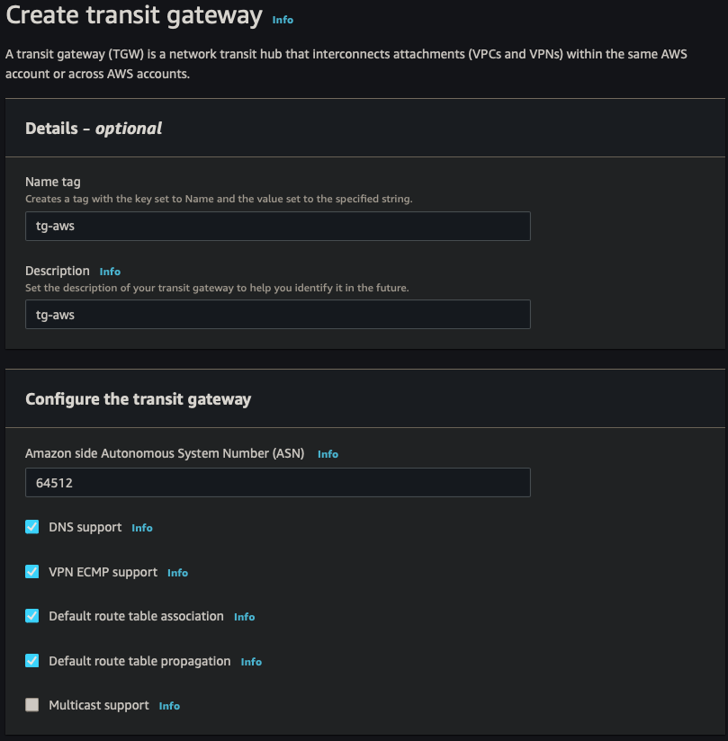
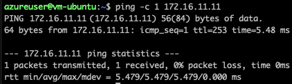
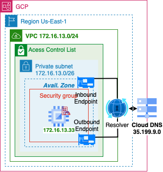

## Goals

The purpose of this guide is to create four distributed networks and combine them into one highly available logically connected network.

- Build with the top three cloud vendors ([aws.amazon.com], [azure.microsoft.com], [cloud.google.com]) and one On-Premise ([pfsense.org]) network
- Scale [Mesh] network topology to allow additional point-to-point connections
- Dynamic routing between Autonomous Systems ([AS]) using Border Gateway Protocol ([BGP])
- Encrypt network traversal over Virtual Private Network (VPN) tunnels using Internet Protocol Security ([IPSec])

[aws.amazon.com]: https://aws.amazon.com
[azure.microsoft.com]: https://azure.microsoft.com
[cloud.google.com]: https://cloud.google.com
[pfsense.org]: https://pfsense.org

[Mesh]: https://www.computerhope.com/jargon/m/mesh.htm
[AS]: https://en.wikipedia.org/wiki/Autonomous_system_(Internet)#:~:text=An%20autonomous%20system%20(AS)%20is,routing%20policy%20to%20the%20Internet.
[BGP]: https://www.cloudflare.com/learning/security/glossary/what-is-bgp/
[IPSec]: https://www.geeksforgeeks.org/ip-security-ipsec/

|[AWS](#aws)|[Azure](#azure)|[CGP](#gcp)|[PFSense](#pfsense)|
|:-:|:-:|:-:|:-:|
|[Network](#network)|[VNET](#vnet)|[VPC](#vpc)|[VLAN](#vlan)|
|[Gateway](#gateway)|[VWAN](#vwan)|[NCC](#network-connectivity-center)|[ISP](#isp)|
|[DNS](#dns)|[Private Resolver](#private-resolver)|[Cloud DNS](#cloud-dns)|[Pihole](#pihole)|
|[S2S](#site-to-site)|[Connection](#connection)|[Peer VPN](#peer-vpn)|[IPSec](#ipsec)|
|[SSM](#ssm)|[Azure vm](#azure-vm)|[GCP vm](#gcp-vm)|[Mac](#mac)|

<!-- truncate -->

## Network


- Final mesh network topology architecture

## AWS


### Network


- Create a Virtual Private Cloud Network in AWS


|||
|:-:|:-:|
|Resource to Create|VPC and more|
|Name|vpc-aws|
|IPv4 CIDR block|172.16.11.0/24|
|Num of AZs|2|
|Public|0|
|Private|2|
|NAT|None|
|Endpoint|None|

### Gateway


- Identify the IP address of the ISP
- Point to Point Identification and traffic passthrough

#### Customer Gateway


|||
|:-:|:-:|
|Name|pfsense|
|BGP ASN|65000|
|IP address|4.4.4.4|

#### Transit Gateway




|||
|:-:|:-:|
|Name|tg-aws|
|Description|tg-aws|
|ASN|64512|

#### Route Table


- Update routes to TGW

### DNS


- AWS will dedicate a reserved IP address x.x.x.2 for a VPC resolver
- Outbound Endpoints will allow you to forward DNS requests for resolvers on other networks
- Inbound Endpoints will allow resolvers on other networks to forward requests to AWS

#### Outbound Endpoint


|||
|:-:|:-:|
|Endpoint Name|oe-aws|
|VPC|vpc-aws-vpc|
|Security Group|Default|
|Endpoint Type|IPv4|
|IP Address #1|AZ us-east-1, subnet 1, IPv4|
|IP Address #2|AZ us-east-2, subnet 2, IPv4|
|Rule Name|onpremise|
|Rule Rule Type|Forward|
|Domain Name|firewall.lan|
|VPC Rule|vpc-aws-vpc|
|Target IP #1|10.0.1.2:53|
|Target IP #2|10.0.4.2:53|

#### Inbound Endpoint


|||
|:-:|:-:|
|Endpoint Name|ie-aws|
|VPC|vpc-aws-vpc|
|Security Group|Default|
|Endpoint Type|IPv4|
|IP Address #1|AZ us-east-1, subnet 1, IPv4|
|IP Address #2|AZ us-east-2, subnet 2, IPv4|

### Site to Site


- Use IPsec tunnels to connect AWS to another datacenter
- Have a failover connection for High availability


|||
|:-:|:-:|:-:|
|AWS|s2s-aws-pfsense|
|Target gateway type|Transit Gateway|
|Transit Gateway|TGW|
|Customer Gateway|CGW|
|Routing Options|Dynamic|
|Tunnel inside IP|IPv4|
|Inside IPv4 CIDR for tunnel 1|169.254.11.0/30|
|Pre-shared key for tunnel 1|strong password|
|Inside IPv4 CIDR for tunnel 2|169.254.12.0/30|
|Pre-shared key for tunnel 2|strong password|

#### Status


- When BGP session is established, the status will go from down to up


### SSM


- Using AWS System Manager will allow remote access without opening any ssh ports
- Use to keep your network private
- Use to debug any connectivity issues

[AWS System Manager]: https://docs.aws.amazon.com/systems-manager/latest/userguide/what-is-systems-manager.html

#### IAM Role Policy

```json
{
    "Version": "2012-10-17",
    "Statement": [
        {
            "Action": [
                "ssm:DescribeAssociation",
                "ssm:GetDeployablePatchSnapshotForInstance",
                "ssm:GetDocument",
                "ssm:DescribeDocument",
                "ssm:GetManifest",
                "ssm:GetParameter",
                "ssm:GetParameters",
                "ssm:ListAssociations",
                "ssm:ListInstanceAssociations",
                "ssm:PutInventory",
                "ssm:PutComplianceItems",
                "ssm:PutConfigurePackageResult",
                "ssm:UpdateAssociationStatus",
                "ssm:UpdateInstanceAssociationStatus",
                "ssm:UpdateInstanceInformation"
            ],
            "Resource": "*",
            "Effect": "Allow"
        },
        {
            "Action": [
                "ssmmessages:CreateControlChannel",
                "ssmmessages:CreateDataChannel",
                "ssmmessages:OpenControlChannel",
                "ssmmessages:OpenDataChannel"
            ],
            "Resource": "*",
            "Effect": "Allow"
        },
        {
            "Action": [
                "ec2messages:AcknowledgeMessage",
                "ec2messages:DeleteMessage",
                "ec2messages:FailMessage",
                "ec2messages:GetEndpoint",
                "ec2messages:GetMessages",
                "ec2messages:SendReply"
            ],
            "Resource": "*",
            "Effect": "Allow"
        }
    ]
}
```

#### Endpoint

##### SSM Endpoint


|||
|:-:|:-:|:-:|
|Name|ssm-endpoint|
|Service Category|AWS Service|
|Service|SSM|
|VPC|vpc-aws-vpc|
|Subnets|us-east-1, us-east-2|
|Security Group|Default|
|Policy|Full Access|

##### SSMMessage Endpoint


|||
|:-:|:-:|:-:|
|Name|ssmmessage-endpoint|
|Service Category|AWS Service|
|Service|SSMmessages|
|VPC|vpc-aws-vpc|
|Subnets|us-east-1, us-east-2|
|Security Group|Default|
|Policy|Full Access|

##### EC2Message Endpoint


|||
|:-:|:-:|:-:|
|Name|ec2message-endpoint|
|Service Category|AWS Service|
|Service|ec2messages|
|VPC|vpc-aws-vpc|
|Subnets|us-east-1, us-east-2|
|Security Group|Default|
|Policy|Full Access|

## Azure


### VNET


- Create a Virtual Network on Azure

#### Resource Group


- Resource Group provides a single detailed view of all resources in a groups stack

|||
|:-:|:-:|
|Resource group|rg-aws-azure|
|Region|East US|

#### Virtual Network


- This Iaas will build a virtual network similar to a VPC
- Create 1 network /24 CIDR to create 4 subnets with /26 CIDR

|||
|:-:|:-:|
|Resource group|rg-aws-azure|
|Name|vnet-aws-azure|
|Region|East US|
|Bastion|Disabled|
|Firewall|Disabled|
|DDoS|Disabled|
|Adress Space|172.16.12.0/24|
|Subnet|172.16.12.0/26|

### VWAN


- TODO: [Azure VWAN]
- Have a AWS site-to-site connection config to populate data

[Azure VWAN]: https://learn.microsoft.com/en-us/azure/virtual-wan/virtual-wan-about

#### Local Network Gateway


- IP of the customer/data center Gateway

|||
|:-:|:-:|
|Resource group|rg-aws-azure|
|Region|East US|
|Endpoint|IP Address|
|IP Address|1.1.1.1|
|Address Space(s)|None|
|ASN|64512|
|BGP|169.254.21.1|

##### Reserved APIPA

|||
|:-:|:-:|:-:|
|AWS|169.254.0.0/16|
|Azure|169.254.21.0/24 - 169.254.22.0/24|

#### Virtual Network Gateway


|||
|:-:|:-:|
|Resource group|rg-aws-azure|
|Region|East US|
|SKU|VPNGw2AZ|
|Generation|2|
|VNET|vnet-aws-azure|
|Subnet|172.16.12.64/27|
|Gateway Type|VPN|
|VPN Type|Route Based|
|Active-active|Disabled|
|BGB|Enabled|
|ASN|65000|
|Custom APIPA|169.254.21.2, 169.254.22.2|
|Public IP adress|vng-aws-azure-pip|

### Private Resolver


- TODO: [Azure DNS]

[Azure DNS]: https://learn.microsoft.com/en-us/azure/dns/dns-overview

### Connection


- Use to create an IPsec connection using BGP
- Create a second connection for failover


|||
|:-:|:-:|
|Resource group|rg-aws-azure|
|Region|East US|
|Connection type|Site-to-site(IPsec)|
|Connection name|conn-1-aws-azure|
|Virtual Network Gateway|vng-aws-azure|
|Local Network Gateway|lng-aws-azure|
|IKE Protocol|IKEv2|
|IpSec / IKE policy|Default|
|Use Policy based traffic selector|Disable|
|DPD timeout|45|
|Connection Mode|Default|
|BGP|169.254.21.2|

### BGP


- Verify Connection is enabled
- Create second connection for failover


- Verify Route propagation from BGP

### Azure VM



- Azure -> AWS

## GCP


### VPC


- Create a Virtual Private Cloud on Google


|||
|:-:|:-:|
|Name|vpc-gcp-aws|
|Description|VPC|
|IPv6|Disabled|
|Subnet|Custom|
|Subnet Name|Private|
|Subnet Region|us-east-1|
|IP stack|IPv4|
|IP range|172.16.13.0/24|
|Private Google Access|off|
|Flow Logs|off|
|IPv4 Firewall Rule|Ingress Apply to all 0.0.0.0/0 ICMP Allow|
|Dynamic Routing|Regional|

### Network Connectivity Center


- TODO: [GCP Network Connectivity]
- Have a AWS site-to-site connection config to populate data

[GCP Network Connectivity]: https://cloud.google.com/network-connectivity/docs/concepts

#### Cloud Router


|||
|:-:|:-:|
|Name|cr-gcp|
|Description|route|
|Network|vpc-gcp-aws|
|Region|us-east-1|
|ASN|65000|
|Interval|20|
|Routes|Advertise all subnets to CR|

#### VPN Gateway


|||
|:-:|:-:|
|Name|vpn-gcp-aws|
|Network|vpc-gcp-aws|
|Region|us-east-1|
|IP stack|IPv4|

### Cloud DNS



- TODO: [GCP DNS]

[GCP DNS]: https://cloud.google.com/dns

### Peer VPN


- Set up the infrastructure for GCP VPN


- Repeats these steps on interface 1 (failover)

|||
|:-:|:-:|
|Name|vpng-gcp-aws|
|Interfaces|two interfaces|
|Interface 0|3.3.3.3|
|Interface 1|3.3.3.2|
|Peer VPN Gateway|On-Prem or Non Google|
|Peer VPNG Name|vpng-gcp-aws|
|High Availability|Create a pair of VPN tunnles|
|Cloud Router|cr-gcp|
|Associated Peer VPNG interface|0: 1.1.1.1|
|Name|conn1-gcp-aws|
|pre-shared key|strong password|
|Peer ASN|64512|

#### BGP


|||
|:-:|:-:|
|Name|conn1|
|Peer ASN|64512|
|BGB IPv4 address|Manually|
|Cloud Router BGP|169.254.250.138|
|BGP Peer Address|169.254.250.137|


- Verify Dynamic Route update

### GCP vm


- GCP -> AWS

## PFSense


### VLAN

Check out this write-up on how to configure [VLANs] with pfsense

[VLANs]: https://dev.to/aakhtar3/build-networks-with-vlans-1ldd

### ISP

TODO: Check out this write-up on how to configure a VPN Server with pfsense

### PiHole

TODO: Check out this write-up on how to configure a DNS server with PiHole

### IPSec

#### Phase 1


- Start by creating a primary tunnel and repeat the below steps for the failover connection tunnel 2


|||
|:-:|:-:|
|Description|conn1-aws-pfsense|
|Key Exchange version|IKEv2|
|Remote Gateway|1.1.1.1|
|Pre-Shared Key|strong password key token|
|Algorithm|AES|
|Key Length|128 bits|
|Hash|SHA256|
|DH Group|14 (2048 bit)|
|Max failures|3|

#### Phase 2


- Start by creating a primary tunnel and repeat the below steps for the failover connection tunnel 2


|||
|:-:|:-:|
|Description|conn1-aws-pfsense|
|Mode|Routed (VTI)|
|Local Network|address: 169.254.11.12|
|Remote Network|address: 169.254.11.11|
|Encryption Algorithm|AES256-CGM 128bits|
|Ping Host|172.16.11.11|
|Keep Alive|Enabled|

#### Status


- Both primary and failover tunnels connected with IPSec

#### BGP

##### FRR Global Settings


|||
|:-:|:-:|
|Enabled|true|
|Master Password|strong password|

##### FRR Route Maps


|||
|:-:|:-:|
|Name|Allow-all|
|Action|Permit|
|Sequence|100|

##### FRR BGB


|||
|:-:|:-:|
|Enabled|true|
|Local AS|65000|
|Router ID|10.0.1.1|
|Networks to distrbute|10.0.1.0/28, 10.0.2.0/29, 10.0.4.0/28|

##### FRR Neighbors


- Start with the primary tunnel and repeat the steps for the failover tunnel


|||
|:-:|:-:|
|Name/Address|169.254.11.12|
|Description|conn1-aws-pfsense|
|Remote AS|64512|
|Inbound Route Map Filters|Allow-all|
|Outbound Route Map Filters|Allow-all|

##### FRR Status


- Verify Dynamic Routes have been updated


- View the BGP Summary

### Mac


- Mac -> AWS
