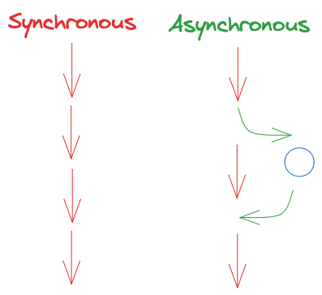

Node.js is a very powerful server-side javascript framework that excels in single-thread asynchronous I/O and is constantly updating with new features.

This guide is meant to be a resource to understand the multi-threading APIs and provide:

- High-level computer science concepts
  - [Synchronous vs Asynchronous](#synchronous-vs-asynchronous)
  - [Concurrency](#concurrency)
  - [Sequential vs Parallel](#sequential-vs-parallel)
  - [Distributed](#distributed)
  - [Process vs Thread](#process-vs-thread)
  - [Javascript Engine](#javascript-engine)
- Code examples of node.js API and performance metrics
  - [Thread blocking operation](#thread-blocking-operation)
  - [Split operation into async tasks](#split-operation-into-async-tasks)
  - [Invoke multi thread operations](#invoke-multi-thread-operations)

<!-- truncate -->

## Synchronous vs Asynchronous



- [Synchronous] - Operations are expected to start and finish in a time span.
- [Asynchronous] - Operations can be deferred till a later time.

## Concurrency


- [Concurrency] - Multiple operations are handled at the same time.

## Sequential vs Parallel


- [Sequential] - Multiple operations are done in a linear fashion.
- [Parallel] - Multiple operations are done at the same time.

## Distributed


- [Distributed] - Multiple operations are done independently on segmented resources.

## Process vs Thread


- [Process] - A program can use single or multiple threads.
- [Thread] - Code execution is invoked and uses less resources than a process.

## Javascript Engine


- [Javascript Engine] - Node.js process runs on top of the google chrome v8 engine.
  - Heap - Memory management of variables. 
  - Call Stack - Code running on main thread.
  - Thread Pool - Async code pending to be executed.
  - Callback Queue - Async code ready to be executed.
  - Event Loop - Async code is pushed on to empty call stack.

[Synchronous]: https://en.wikipedia.org/wiki/Synchronous_programming_language
[Asynchronous]: https://en.wikipedia.org/wiki/Asynchrony_(computer_programming)
[Concurrency]: https://en.wikipedia.org/wiki/Concurrent_computing
[Sequential]: https://google.com
[Parallel]: https://en.wikipedia.org/wiki/Parallel_computing
[Distributed]: https://en.wikipedia.org/wiki/Distributed_computing
[Process]: https://en.wikipedia.org/wiki/Process_(computing)
[Thread]: https://en.wikipedia.org/wiki/Thread_(computing)
[Javascript Engine]: https://en.wikipedia.org/wiki/V8_(JavaScript_engine)

## Thread Blocking Operation

Here is an example of a long running operation that will increment a counter variable from 'zero' to 'ten billion'.

The snippet of code will block all other operations on the thread since it is a 'synchronous' operation.

- ex: web browser freezes after clicking a button.
- ex: locking a database record when making an update.

### Prerequisite

- node -v @12+
- `echo '{ "type": "module" }' > package.json`

```js
const blockingOperation = (operations = 10_000_000_000) => {
    let counter = 0;

    while (counter < operations) counter += 1;

    console.log({ counter }); 

    return counter;
};

(() => blockingOperation())();
```

> time node index.js

```bash
{ counter: 10000000000 }
node index.js 7.80s user 0.04s system 99% cpu 7.849 total
```

- Executing this program takes around `~8` seconds.
  - Running on a single CPU core (`single-thread`).
  - `Sync` tasks are blocking the thread.

## Split Operation into Async Tasks

Building on the example, we introduce [Promises] to invoke asynchronous operations.

In addition, the large operation will be split based on the number of CPU cores on the machine.

- This chunking strategy will shorten the task's size of operations.
- `tasks = (operations / threads)`

Async will allow the program to handle `concurrent` operations.

- ex: web server accepting multiple API requests.
- ex: video game accepting multiple clicks on a keyboard.

[Promises]: https://developer.mozilla.org/en-US/docs/Web/JavaScript/Reference/Global_Objects/Promise

```js
import { cpus } from 'os';

const getUTCSeconds = () => new Date().getUTCSeconds();

const blockingOperation = (operations) => new Promise((resolve) => {
    let counter = 0;

    while (counter < operations) counter += 1;

    console.log({ counter, utcSecond: getUTCSeconds() });

    resolve(counter);
});

const splitOperationIntoAsyncTasks = async () => {
    const operations = 10_000_000_000;
    const threads = cpus().length;
    const tasks = (operations / threads);

    const blockingOperations = new Array(threads).fill()
        .map(() => blockingOperation(tasks))

    const countOperations = await Promise
        .all(blockingOperations);

    const totalCount = countOperations
        .reduce((sum, counter) => (sum + counter), 0);

    console.log({ operations, threads, tasks, totalCount });

    return totalCount;
};

(async () => splitOperationIntoAsyncTasks())();
```

> time node index.js

```bash
{ counter: 1250000000, utcSecond: 21 }
{ counter: 1250000000, utcSecond: 22 }
{ counter: 1250000000, utcSecond: 22 }
{ counter: 1250000000, utcSecond: 23 }
{ counter: 1250000000, utcSecond: 23 }
{ counter: 1250000000, utcSecond: 24 }
{ counter: 1250000000, utcSecond: 24 }
{ counter: 1250000000, utcSecond: 25 }
{
  operations: 10000000000,
  threads: 8,
  tasks: 1250000000,
  totalCount: 10000000000
}
node index.js  4.35s user 0.02s system 99% cpu 4.372 total
```

- Executing this program takes around `~4` seconds.
- We see a `50%` performance improvement.
  - Running on a single CPU core (`single-thread`).
  - `Async` tasks are processed in `sequential`.

## Invoke Multi Thread Operations

The final step is to introduce the multi-thread API [worker threads].

There are two concepts that are at play:

- Parent (main thread)
  - `if (isMainThread) return new Worker(__filename)`
- Child (worker thread)
  - `parentPort.postMessage(await blockingOperation())`

The parent will create multiple children and wait for the messages to be returned.

[worker threads]: https://nodejs.org/api/worker_threads.html

```js
import { cpus } from 'os';
import { dirname } from 'path';
import { fileURLToPath } from 'url';
import { isMainThread, Worker, parentPort } from 'node:worker_threads';

const __filename = dirname(fileURLToPath(import.meta.url));

const createWorker = async () => new Promise ((resolve, reject) => 
    new Worker(__filename)
        .on('message', (data) => resolve(data))
        .on('error', (error) => reject(error))
        .on('exit', (code) => { if (code !== 0) reject(new Error(`Thread exit code: ${code}`)); }));

const getUTCSeconds = () => new Date().getUTCSeconds();

const blockingOperation = (operations) => new Promise((resolve) => {
    let counter = 0;

    while (counter < operations) counter += 1;

    console.log({ counter, utcSecond: getUTCSeconds() });

    resolve(counter);
});

const runTaskInParallel = async (operations, threads, tasks) => {
    const blockingOperations = new Array(threads).fill()
        .map(() => createWorker(tasks));

    const countOperations = await Promise
        .all(blockingOperations);

    const totalCount = countOperations
        .reduce((sum, counter) => (sum + counter), 0);

    console.log({ operations, threads, tasks, totalCount });

    return totalCount;
};

const invokeMultiThreadOperations = async () => {
    const operations = 10_000_000_000;
    const threads = cpus().length;
    const tasks = (operations / threads);
    
    if (isMainThread) return runTaskInParallel(operations, threads, tasks);
    
    parentPort.postMessage(await blockingOperation(tasks));
};

(async () => invokeMultiThreadOperations())();
```

> time node index.js

```bash
{ counter: 1250000000, utcSecond: 59 }
{ counter: 1250000000, utcSecond: 59 }
{ counter: 1250000000, utcSecond: 59 }
{ counter: 1250000000, utcSecond: 59 }
{ counter: 1250000000, utcSecond: 59 }
{ counter: 1250000000, utcSecond: 59 }
{ counter: 1250000000, utcSecond: 59 }
{ counter: 1250000000, utcSecond: 59 }
{
  operations: 10000000000,
  threads: 8,
  tasks: 1250000000,
  totalCount: 10000000000
}
node index.js  6.38s user 0.05s system 711% cpu 0.903 total
```

- Executing this program takes around `~1` second.
- We see a `87%` performance improvement.
  - Running on a multi CPU core (`multi-thread`).
  - `Async` tasks are processed in `parallel`.