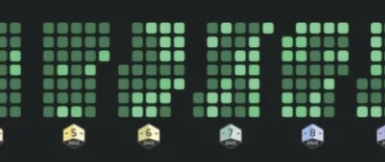
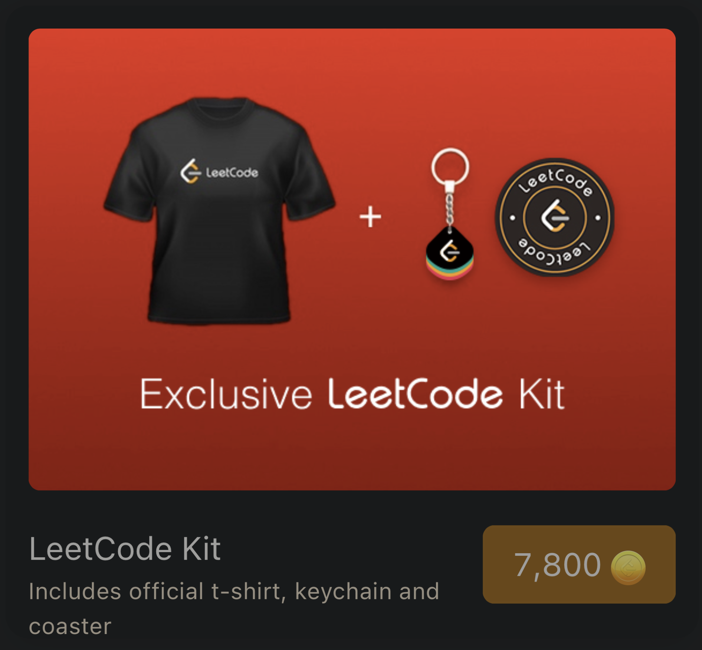
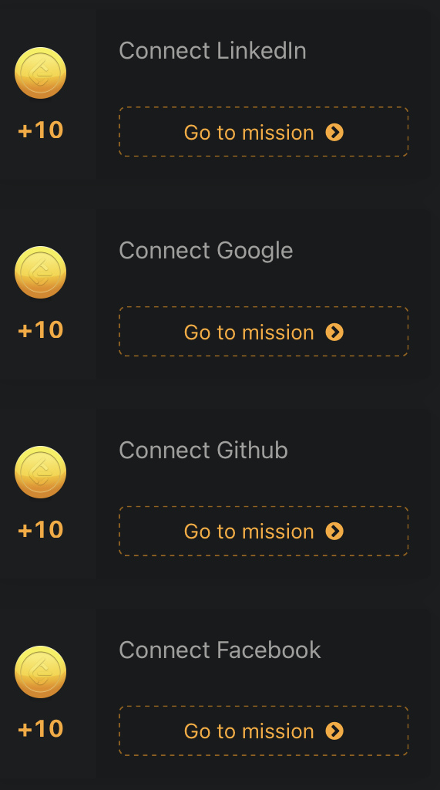
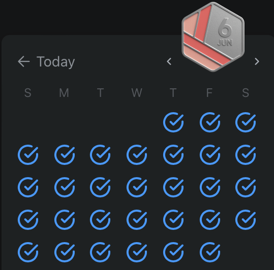
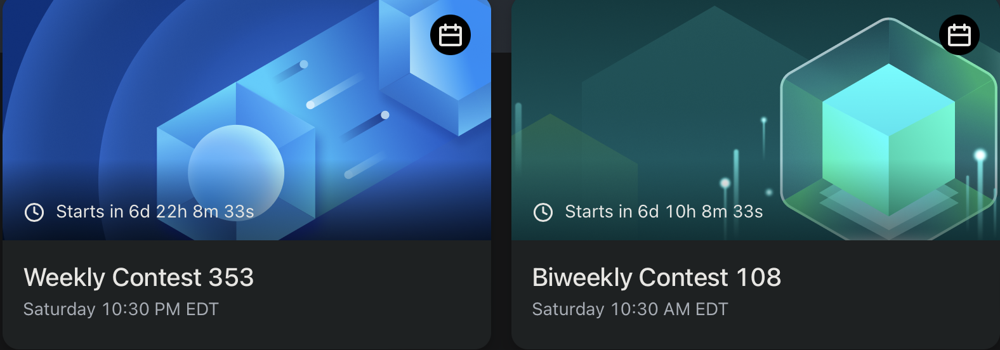
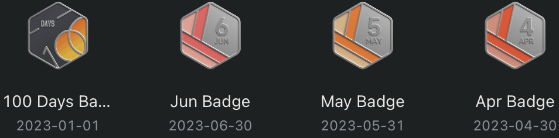

|[Goal](#goal)|[Tasks](#tasks)|[Tips](#tips)|
|:-:|:-:|:-:|
|T-shirt|13|8,435 coins|

<!-- truncate -->

Hate it or love it, but [leetcode.com] has become the de facto learning tool to prepare for software engineering coding interviews. Other skills are required to do the job, but this interview standard has its benefits by providing candidates a fair chance at solving a timed problem in a stressful environment.

Investing time to master and retain data structures and algorithms will net you a great ROI by helping you become a top earner. In addition, having a deep understanding of the material will make you a subject matter expert and a top performer.

[leetcode.com]: https://leetcode.com

## Goal

Leetcode has gamified this egregious grind by providing a [store], where you can redeem your earned coins for prizes. The prizes are nothing spectacular, but earning the t-shirt is an exciting challenge since `6,000` (t-shirt) or `7,800` (t-shirt, keychain, and coaster) coins will require a lot of time, discipline, and commitment.

[store]: https://leetcode.com/store

## Tasks

Below is a breakdown to earn the maximum amount of coins to get the t-shirt in less than a year.

|Type|Tasks|Per Year|
|:-:|:-:|:-:|
|[Social Media](#social-media)|4|40 (One time)|
|[Daily](#daily)|2|4,015|
|[Weekly](#weekly)|2|2,080|
|[Bi-Weekly](#bi-weekly)|2|1,040|
|[Monthly](#monthly)|3|1,260|
|Total|13|8,435|

- `8,435` coins from doing all 13 tasks.

### Social Media

- Easy coins if you want to share your social media on your profile. 

|Task|Coins|Per Year|
|:-:|:-:|:-:|
|Linkedin|10|10 (One time)|
|Google|10|10 (One time)|
|Github|10|10 (One time)|
|Facebook|10|10 (One time)|

- `40` coins from connecting social media accounts.

### Daily

- View the daily [challenges] from the problem page.

[challenges]: https://leetcode.com/problemset/all

|Task|Coins|Per Year|
|:-:|:-:|:-:|
|Daily Check-in|1|365|
|Daily Challenge|10|3,650|

- `4,015` coins from daily check-in and solving daily challenge.

### Weekly

- View the weekly [challenges] from the problem page.

|Task|Coins|Per Year|
|:-:|:-:|:-:|
|Weekly Challenge|35|1,820|
|Weekly Contest|5|260|

- `2,080` coins from solving the weekly challenge and attending the weekly contests.

### Bi Weekly

- Register to participate in the bi/weekly [contest(s)].

[contest(s)]: https://leetcode.com/contest

|Task|Coins|Per Year|
|:-:|:-:|:-:|
|Bi-Weekly Contest|5|130|
|Attend Bi/Weekly Contests|35|910|

- `1,040` coins from attending bi-weekly contests and attending both contests.

### Monthly

- Earn badges for keeping your streak.

|Task|Coins|Per Year|
|:-:|:-:|:-:|
|30 Day Check-in Streak|30|360|
|25 Challenges Streak|25|300|
|Entire Month of Daily Challenges|50|600|

- `1,260` coins from solving all daily challenges and keeping up your monthly streak.

## Tips

Here are some tips to stay consistent and retain:

- Set up re-occurring calendar blocked time slot (one hour) for daily/weekly challenges and bi/weekly contests.
- Refactor the solution with cleaner and descriptive code.
- Add `Time O(…) | Space O(…)` complexities in your solution.
- Share your solutions on Leetcode and GitHub.
- Buy and use a `Time Travel Ticket` from the store if you miss a day (Long flights 😡).
