Kubernetes is a dense topic, so here are some key topics to review.

|[Kubernetes](#kubernetes)|[Component](#component)|[Application](#application)|[Istio](#istio)|
| :-: | :-: | :-: | :-: |
|[Terraform](#terraform)|[Pod](#pod)|[Servicee](#service)|[Control Plane](#control-plane)|
|[Cluster](#cluster)|[Config Map](#config-map)|[Service Registry](#service-registry)|[Data Plane](#data-plane)|
|[Control Plane Node](#control-plane-node)|[Secrets](#secrets)|[Service Discovery](#service-discovery)|[Traffic Management](#traffic-management)|
|[Worker Node](#worker-node)|[Persistent Volume](#persistent-volume)|[Deployment](#deployment)|[Security](#security)|
|[Namespace](#namespace)|[Policies](#policies)|[Stateful Sets](#stateful-sets)|[Observability](#observability)|

<!-- truncate -->

## Kubernetes

Orchestration service to automate application deployments at scale.

### Terraform

Infrastructure as code to deploy cloud resources that will be used to run Kubernetes.

#### Lifecycle

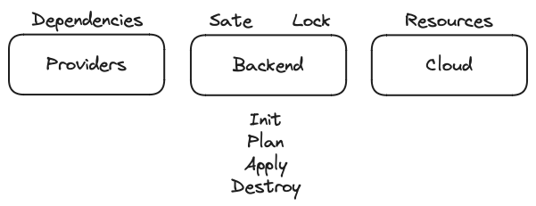

- terraform init - Set up backend and pull dependencies from providers
    - .tfstate - s3
    - .lock - dynamodb
- terrafrom validate - Validate Configs
- terraform fmt - lint suggestions for styling code
- terratest - Testing framework in Go
- terraform plan - Show plan to build desired state and observed state
- terraform apply - Build infrastructure to be in desired state
- terraform destroy - Clean up infrastructure

#### Files

- provider.tf - terraform block, backend, provider config, alias
- main.tf - Resource blocks which define resources to be created
    - resource - declare new component
    - data - pull resource from cloud provider
    - module - pull resource from external source
- variables.tf - variables declarations for resources
- output.tf - Key values generated on successful apply 
- *.tfvars - environment specific default variables

#### Helpers

- meta arguments - depends on, count, for_each, locals
- expressions - operators (arithmetic, equality, comparison, logical), conditionals, splat, constraints 
- functions - String/Number/Collection types, encoding/crpyto/hash, IP networking, filesystem, date/time

### Cluster

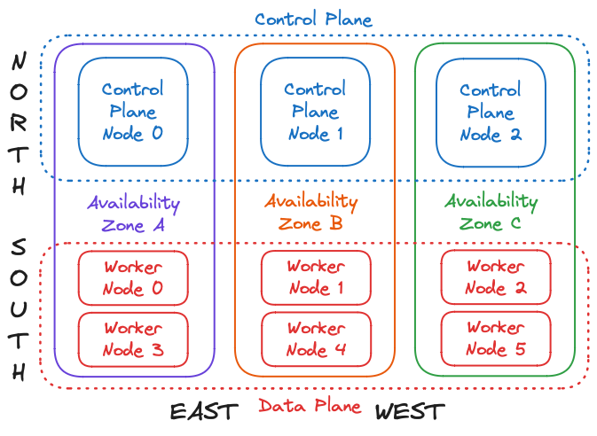

- Cluster - Multiple Control plane nodes for High Availability
- Traffic
  - `North <-> South - Client <-> VPC <-> Ingress`
  - `East <-> West - AZ A <-> AZ B <-> AZ C`

### Control Plane Node

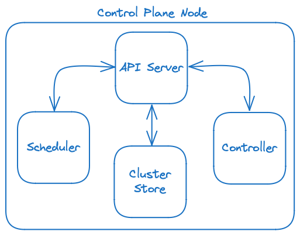

- Api Server - Front end of cluster on RESTful API over HTTPS
- Cluster Store (etcd) - Holds desired state of all components of cluster
- Controller (Manager) - Cluster intelligence, watching cluster to reconcile observed state and desired state
- Scheduler - Handles tasks and assign to capable nodes for work

### Worker Node

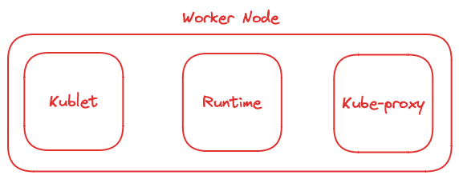

- Kublet - Agent handles workload from cluster and reporting
- Runtime - kernel tasks using **containerd** to manage lifecycle
- Kube-proxy - Cluster networking and load balancing

### Namespace

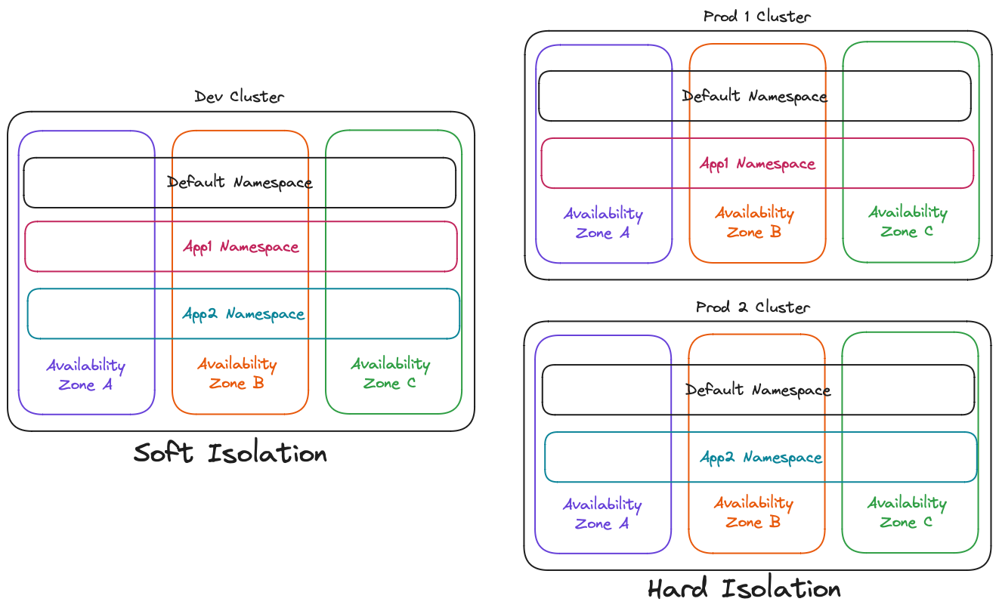

- Default Namespace - Components will be placed here if not specified
- Named Namespace - Isolate components into segmented namespaces
- Isolation
    - Soft - Segment by namespace
    - Hard - Segment by cluster

## Component

Key atomic componentes to build applications on Kubernetes.

### Pod

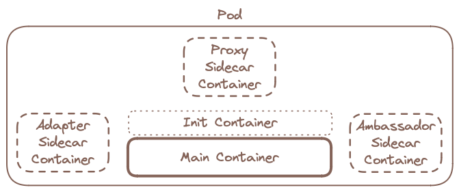

- Init container - Runs once before main container
- Main container - Core functionality of service
- Sidecar container - Optional containers to side load computation
  - Proxy - Handles ingress traffic
  - Ambassador - Handles egress traffic
  - Adapter - Handles telemetry traffic

### Config Map

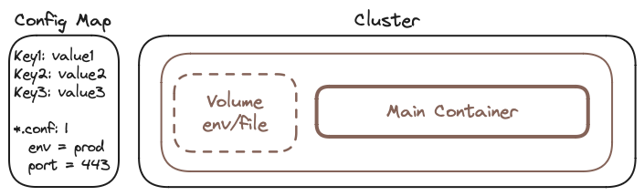

- Environment Variable - Data can be injected to container environment 
- Container Argument - Pass arguments into a container status up command
- Files in Volume - Mount config file into container environment

### Secrets

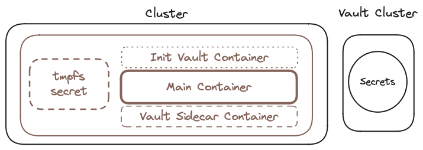

- Native Secrets - Does not encrypt in transit or flight, stores in tmpfs as base64 and decode to plain text 
- Vault Secrets - Require 3rd party integration to mange secrets

### Persistent Volume

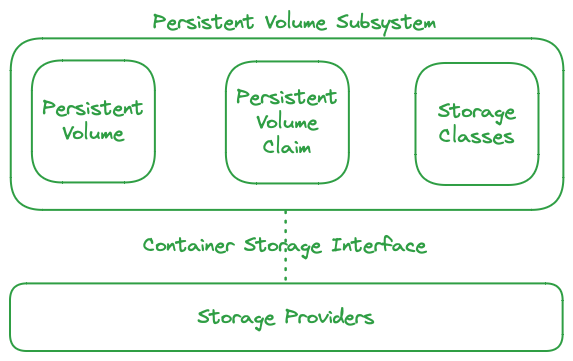

- Persistent Volume Claim (PVC) - Pod need to request/claim volume and grant access to PVs
- Persistent Volume (PV) - Maps to external storage providers
- Storage Classes (SC) - Proxy between PVC and SP and automates the connectivity
- Container Storage Interface (CSI) - Interface plugin to connect to external/cloud SPs
- Storage Providers (SP) - Physical storage disk drives

### Policies

- Role-based access control (RBAC) - Regulate access to groups when invoking the API
- Pod Security Standards (PSS) - Privileged, Baseline, Restricted
- Pod Security Admission (PSA) - enforce, audit, warn

## Application

Package applications into segmented resources on Kubernetes cluster.

### Service

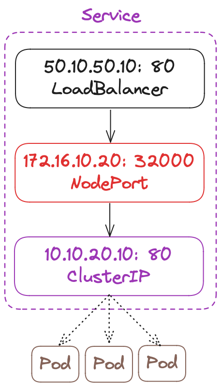

- Ingress - Handle many services on a single load balancer
- Load Balancer - Cloud load balancer to handle traffic for service
- Node Port - Port exposed on port to access service
- Cluster IP - Ip obtained from service registry for service

### Service Registry

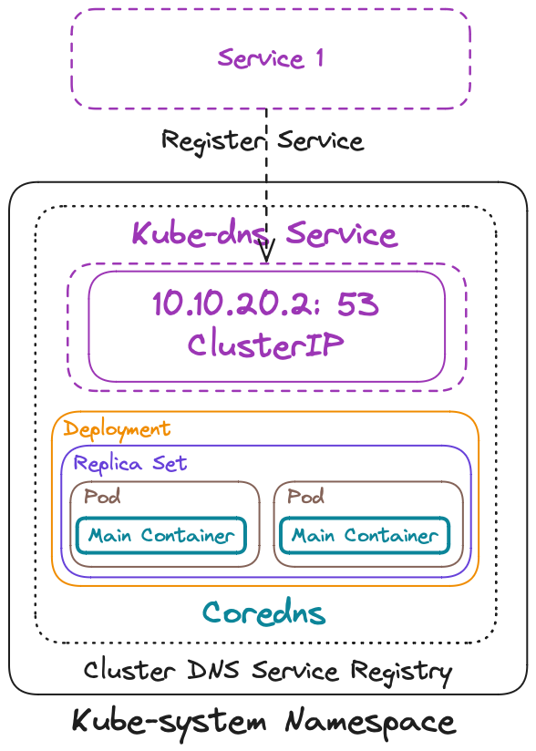

- Kube-system (NS) - Cluster namespace for control plane
- Kube-dns (SVC) - Service registry and discovery
- Coredns (POD) - Application to handle dns traffic

### Service Discovery

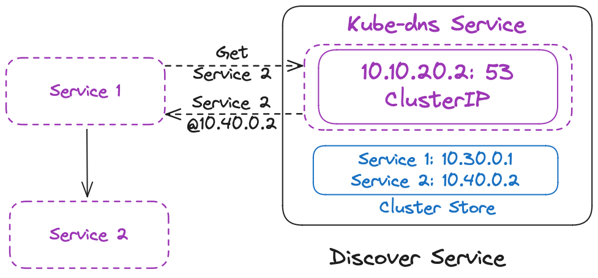

- Cluster Store - Stores DNS records from coredns
- `Fully Qualified Domain Name (FQDN) - {service}.{namespace}.svc.cluster.local`

### Deployment

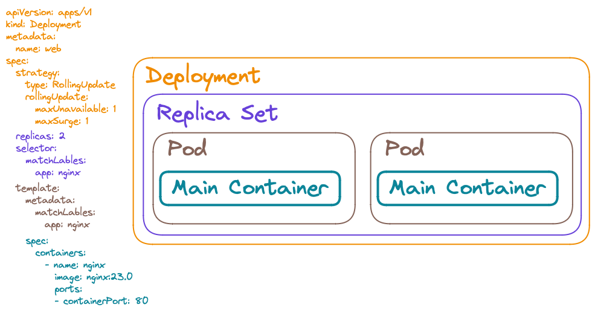

- Deployment - Stateless application 
- Replica Set - Deploy multiple pods in parallel

### Stateful Sets

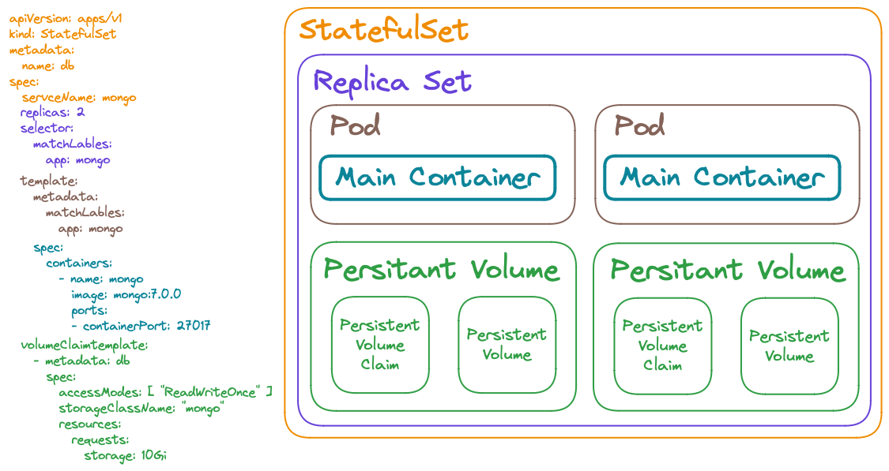

- Stateful Sets - Stateful application that needs to mount data
- Replica Set - Deploy multiple pods in sequence
- Persistent Volume - Requires volume for application

## Istio

Use Service Mesh to mange Kubernetes traffic, security, and observability.

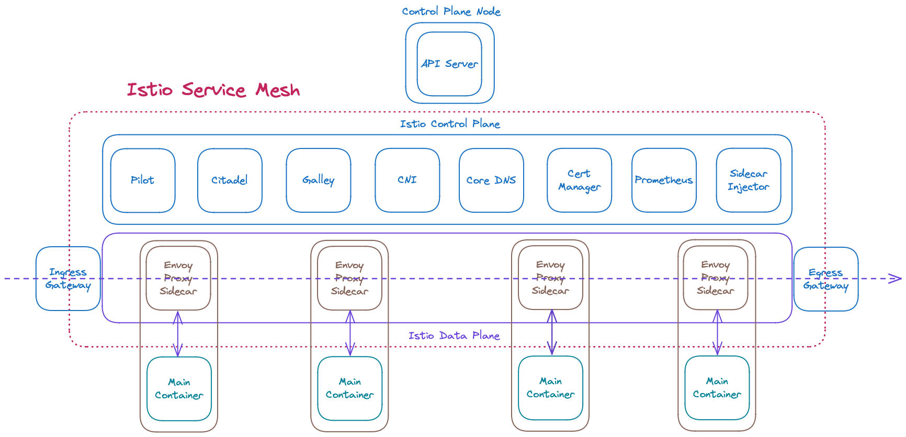

### Control Plane

- Pilot - Service Discovery and configuring sidecar proxies
- Citadel - Automated key and certificate management
- Galley - Validate and deploy Istio configuration
- Container Network Interface (CNI) - Network initialization, init container to sidecar proxy
- Core DNS - DNS resolution
- Policy - CDA Policy enforcer
- Cert Manger - Issue and renew TLS certifications 
- Prometheus - Metrics collector
- Sidecar Injector - Namespace enabled sidecar poxy
- Ingress Gateway - Handle incoming traffic into mesh
- Egress Gateway - Handle outgoing traffic from mesh

### Data Plane

- Envoy - Reverse Proxy Sidecar managed by Traffic management rules

### Traffic Management

- Virtual Services - Configure how requests are routed to service in mesh. Timeout, retry, and fault injection
- Destination Rules - Policies on routing, load balancing, TLS, circuit breaker, etc 
- Gateways - Handle Ingress/Egress traffic to/from mesh
- Service entries - Register services to be added and discovered in Mesh
- Sidecars - Add additional proxy rules on in/e-gress

### Security

- Peer Authentication (Mutual TLS) - Client and Server Envoy sidecar establish two TLS tunnel
- Request Authentication (JWT) - Envoy validate JWT with Public JSON Web Key Set (JWKS)
- Authorization Policies - Envoy engine handle Custom, Deny, Allow policies on traffic rules

### Observability

- Metrics
    - Proxy - In/E-gress Traffic: volume, errors, response times
    - Service - Latency, errors, saturation
    - Control plane - Service regulations, Certs
- Distributed Traces - Sample traffic for monitoring/debugging
- Access Logs - Envoy access logs
