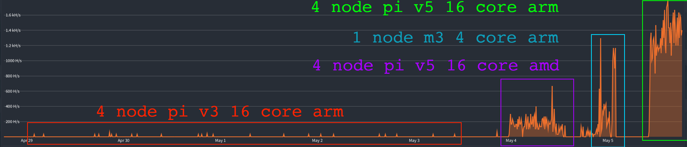
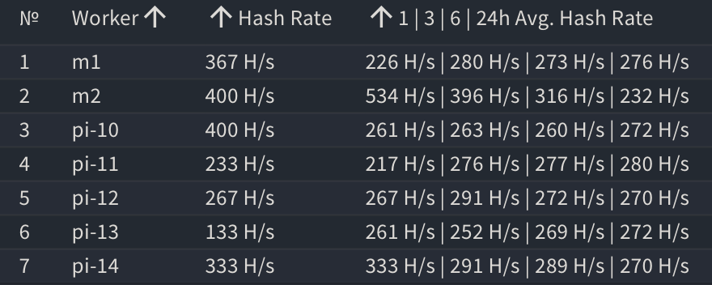

I have been playing around with [xmrig] to see if I could make any money with a few raspberry pi v3 that have been collecting dust. I choose [XMR (Monero)] due to it being ASIC resistant. Which allows the little guys a chance to get rewards for contribution to the blockchain. Also, I am a big fan of the privacy coin.

<!-- truncate -->

[xmrig]: https://xmrig.com
[XMR (Monero)]: https://www.getmonero.org

After testing for 5 months, the conclusion is that the Raspberry [pi v3] is very old and cannot compete with new powerful cpu/gpus. However, the Raspberry [pi v5] is new and has potential to output more computation. In addition, I packaged the software on alpine container to run native to the ARM architecture and the results were very surprising.

I am still in the red due to electricity cost, but ARM helps with the cost due to being energy efficient. The learning in this project is intangible and was worth the minor expense. 

[pi v3]: https://www.raspberrypi.com/products/raspberry-pi-3-model-b-plus/
[pi v5]: https://www.raspberrypi.com/products/raspberry-pi-5/

## Pi Cluster

Building a compact cluster has advantages, by sharing electricity over USB hubs or Power Over Ethernet and segmenting the cluster into its own network.


- ARM is energy efficient and can share power over USB hub of 5v
- Stackable nodes in a segmented network
- Egress over privacy VPN to remain anonymous

## Upgrade Hardware

Switched from Pi v3 to Pi v5.


- Pi v3 - Over 5 months I made $0.00 with a 1 H/s
- Pi v5 - In a day was hitting consistent ~150 H/s and finally made $0.01

## Use ARM architecture

Avoid cross architecture emulation on docker, which causes performance bottlenecks. Instead use native ARM Architecture when packaging your containers.



- Pi v3 arm - 1 H/s
- Pi v5 amd -> arm - ~150 H/s
- m3 arm - ~1 KH/s
- Pi v5 arm - ~1.2 KH/s 

## Summary

Final summary of current setup


- Peaked at 3.5 KH - Improved by 3,500%
- Now make $0.05 per day



- 1 m1 2 core arm
- 1 m2 2 core arm
- 5 Pi v5 20 core arm

## Quick Setup with Wallet

```bash
# https://github.com/aakhtar3/xmrig
docker run -d \
    --name xmrig \
    -e URL=${POOL} \
    -e WALLET=${WALLET} \
    -e NODE_NAME=$(hostname) \
    --cpus="2" \
    --cpu-quota=400000 \
    --cpu-period=100000 \
    aakhtar3/xmrig
```

- Create [WALLET] and run software on docker
- Join a pool POOL - pool.hashvault.pro:443
- Tweak CPU usage based on your cores

[WALLET]: https://www.getmonero.org/downloads/