Build and host your own observability solution with docker and open source software.

## Network Traffic

> Review source code @ https://github.com/osirislab/observability

High level overview of how the control node will run SIEM, while hosts are sending telemetry data.

<!-- truncate -->

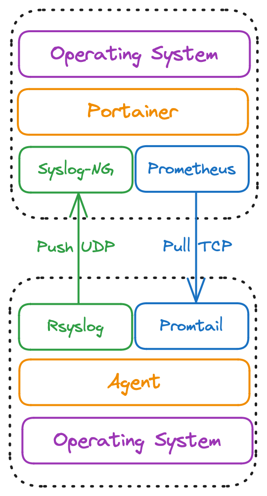

## Portainer

Create install portainer script, set execute permission, and run with docker

> ./install-portainer.sh

```bash
#!/bin/bash

docker volume create portainer_data

docker run -d \
    --name portainer \
    --restart=always \
    -v /var/run/docker.sock:/var/run/docker.sock \
    -v portainer_data:/data \
    -p 8000:8000 \
    -p 9443:9443 \
    portainer/portainer-ce:latest
```

Head over to `https://localhost:9443` and create admin credentials.

### Agent

Separately you can install an agent on a seperate host. This will allow you to manage multiple docker hosts from a single portal.

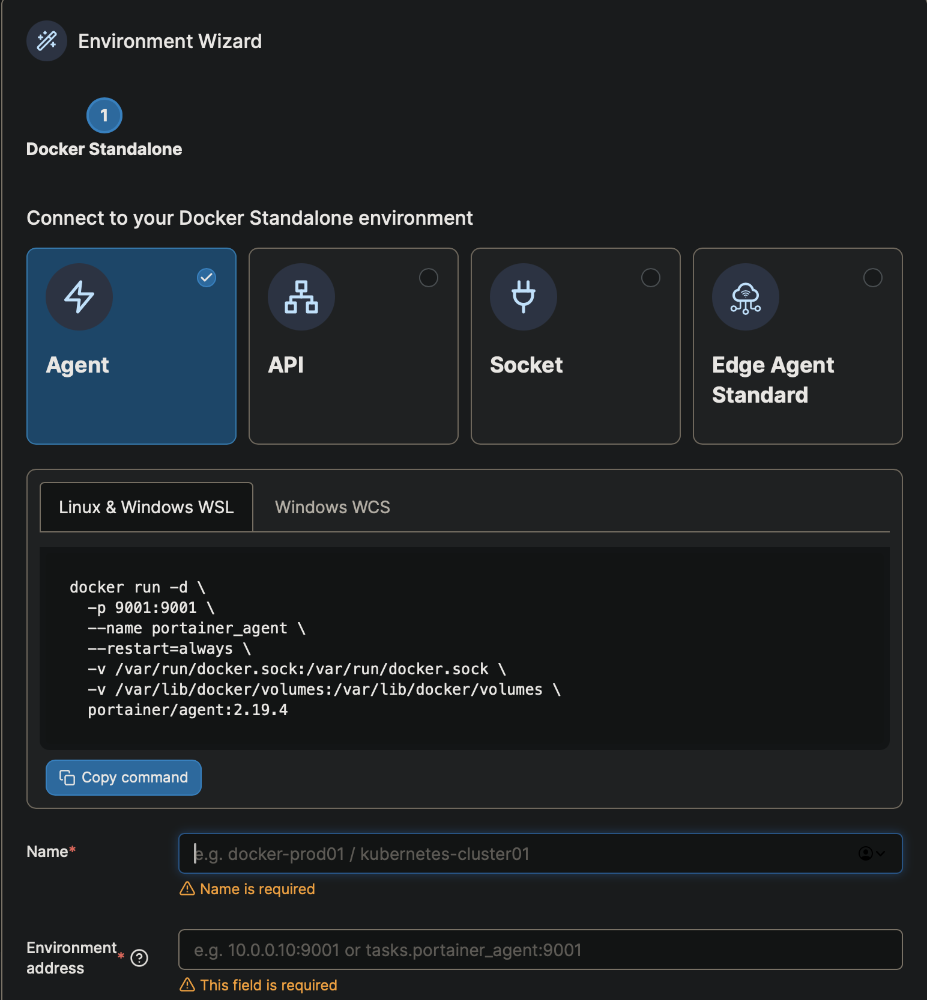


## Stack

Build your siem stack on portainer using an .env and docker-compose.yml

### Create

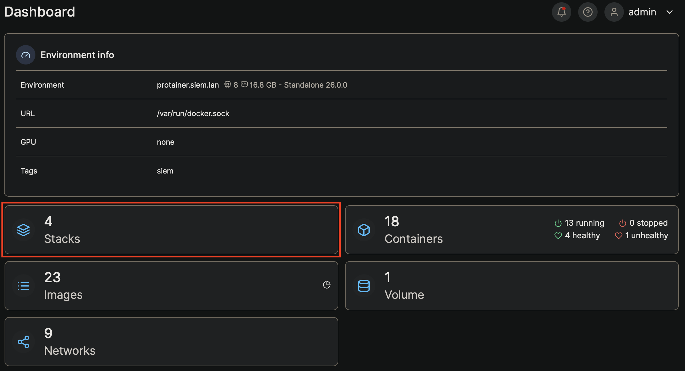


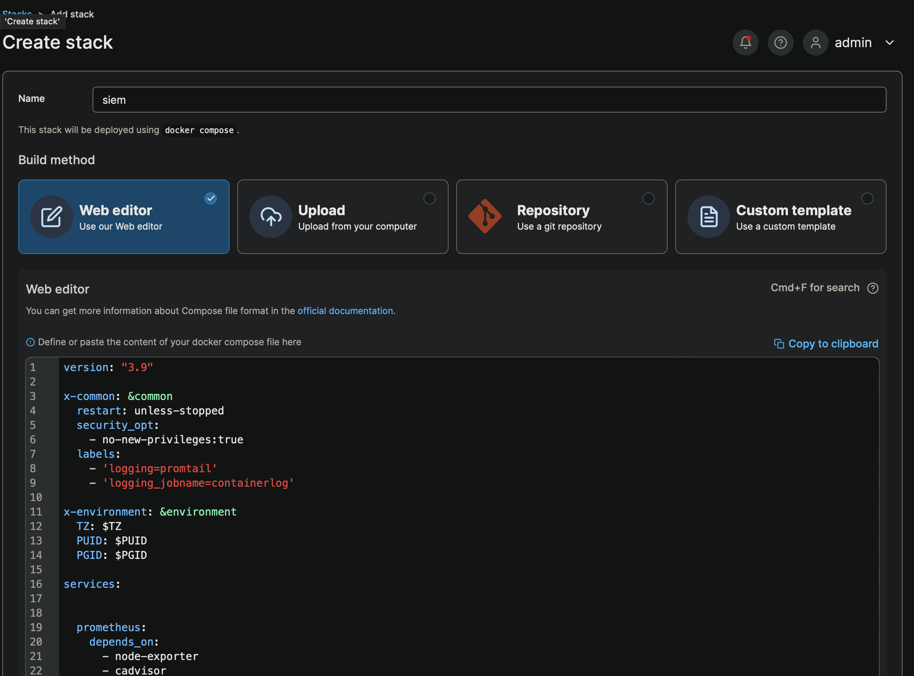

### Env

> siem.env

- Identify your username and replace $(whoami)

```bash
PUID=1000
PGID=1000
TZ=America/New_York
DOCKER_DATA=/home/$(whoami)/siem/data
DOCKER__CONFIG=/home/$(whoami)/siem/config
```


### Compose Common Attributes

These attributes are meant to apply Do Not Repeat Yourself (DRY) templating.

```yml
version: "3.9"

x-common: &common
  restart: unless-stopped
  security_opt:
    - no-new-privileges:true
  labels:
    - 'logging=promtail'
    - 'logging_jobname=containerlog'

x-environment: &environment
  TZ: $TZ
  PUID: $PUID
  PGID: $PGID
```

### Agents

These service are intended to be applied to every host, which allows the portainer control node access to docker deployments and adding observability agents for metrics and logging.

```yml
services:
  ######## Docker ########
  portainer-agent:
    container_name: portainer-agent
    image: 'portainer/agent:2.19.4'
    <<: *common
    volumes:
      - '/var/lib/docker/volumes:/var/lib/docker/volumes'
      - '/var/run/docker.sock:/var/run/docker.sock'
    ports:
      - 9001:9001
    environment:
      <<: *environment

  ######## Metrics ########
  cadvisor:
    depends_on:
      - portainer-agent
    container_name: cadvisor
    image: gcr.io/cadvisor/cadvisor:v0.47.1
    platform: linux/aarch64
    devices:
      - /dev/kmsg:/dev/kmsg
    <<: *common
    volumes:
      - /:/rootfs:ro
      - /var/run:/var/run:rw
      - /sys:/sys:ro
      - /var/lib/docker:/var/lib/docker:ro
    ports:
      - 8080:8080
    environment:
      <<: *environment
  
  node-exporter:
    depends_on:
      - portainer-agent
    container_name: node-exporter
    image: prom/node-exporter:latest
    command: 
      - '--path.procfs=/host/proc' 
      - '--path.sysfs=/host/sys'
      - --collector.filesystem.ignored-mount-points
      - "^/(sys|proc|dev|host|etc|rootfs/var/lib/docker/containers|rootfs/var/lib/docker/overlay2|rootfs/run/docker/netns|rootfs/var/lib/docker/aufs)($$|/)"
    <<: *common
    volumes:
      - /proc:/host/proc:ro
      - /sys:/host/sys:ro
      - /:/rootfs:ro
    ports:
      - 9100:9100
    environment:
      <<: *environment

  ######## Logging ########
  promtail:
    depends_on:
      - portainer-agent
    container_name: promtail
    image: grafana/promtail:2.9.3
    command: -config.file=/etc/promtail/config.yml
    <<: *common
    volumes:
      - $DOCKER__CONFIG/promtail/config.yml:/etc/promtail/config.yml:ro
      - /var/lib/docker/containers:/var/lib/docker/containers:ro
      - /var/run/docker.sock:/var/run/docker.sock
    ports:
      - 9080:9080
      - 1514:1514
    environment:
      <<: *environment
  
  dozzle:
    depends_on:
      - portainer-agent
    container_name: dozzle
    image: amir20/dozzle:latest
    <<: *common
    volumes:
      - /var/run/docker.sock:/var/run/docker.sock
    ports:
      - 8082:8080
    environment:
      <<: *environment
      DOZZLE_LEVEL: info
      DOZZLE_TAILSIZE: 300
      DOZZLE_FILTER: "status=running"
```

## Metrics

Prometheus will scrape promtail for new metrics.

```yml
services:
  prometheus:
    depends_on:
      - node-exporter
      - cadvisor
    container_name: prometheus
    image: prom/prometheus:latest
    user: root
    command:
      - --config.file=/etc/prometheus/prometheus.yml
      - --storage.tsdb.path=/prometheus
      - --web.enable-admin-api
      - --web.enable-lifecycle
    <<: *common
    volumes:
      - $DOCKER__CONFIG/prometheus/config.yml:/etc/prometheus/prometheus.yml:ro
      - $DOCKER_DATA/prometheus:/prometheus
    ports:
      - 9090:9090
    environment:
      <<: *environment
```

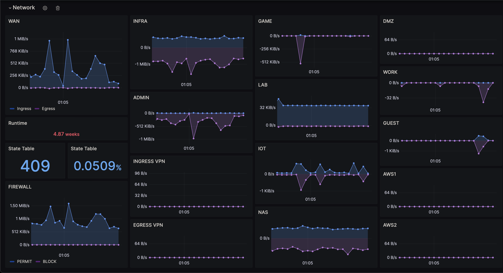

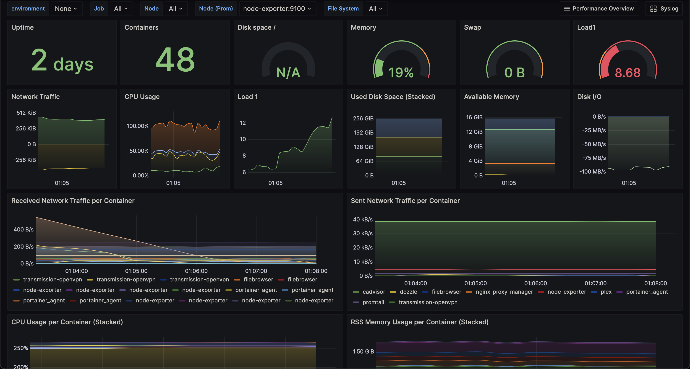

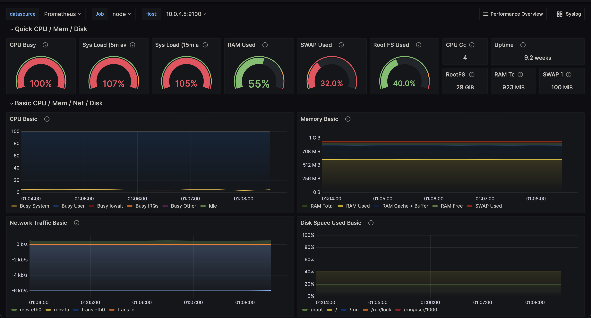

## Logging

These services will handle syslog/container logs and store on mini/loki.

```yml
services:
  minio:
    container_name: minio
    image: minio/minio:latest
    user: root
    entrypoint: sh
    command: -c 'mkdir -p /data/loki && /usr/bin/docker-entrypoint.sh minio server /data'
    healthcheck:
      interval: 30s
      retries: 3
      test:
        - CMD
        - curl
        - -f
        - http://localhost:9000/minio/health/live
      timeout: 20s
    <<: *common
    volumes:
      - $DOCKER_DATA/minio:/data
    environment:
      <<: *environment
      MINIO_ACCESS_KEY: minio123
      MINIO_PROMETHEUS_AUTH_TYPE: public
      MINIO_SECRET_KEY: minio456

  loki:
    depends_on:
      - minio
    container_name: loki
    image: grafana/loki:2.9.3
    user: root
    command: -config.file=/etc/loki/loki-config.yml
    <<: *common
    volumes:
      - $DOCKER__CONFIG/loki/config.yml:/etc/loki/loki-config.yml:ro
      - $DOCKER_DATA/loki:/tmp
    ports:
      - 3100:3100
    environment:
      <<: *environment

  syslog-ng:
    depends_on:
      - promtail
    container_name: syslog-ng
    image: ghcr.io/axoflow/axosyslog:latest
    command: -edv
    <<: *common
    volumes:
      - $DOCKER__CONFIG/syslog-ng/config.conf:/etc/syslog-ng/syslog-ng.conf:ro
    ports:
      - 514:514/udp
    environment:
      <<: *environment
```

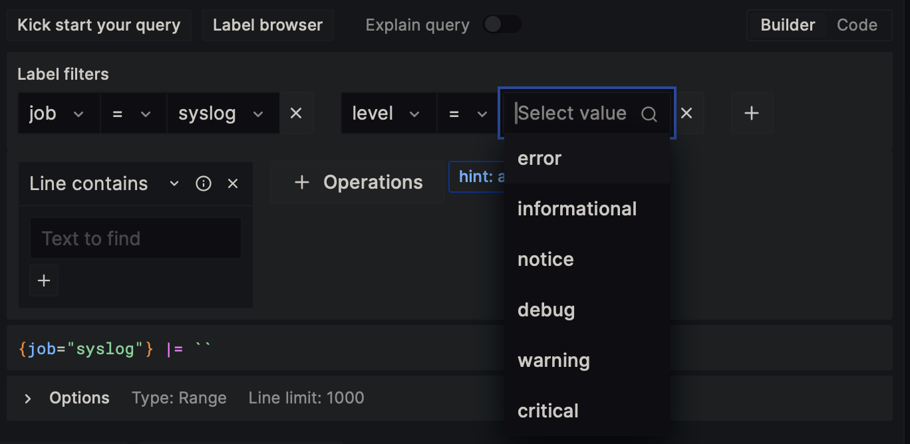

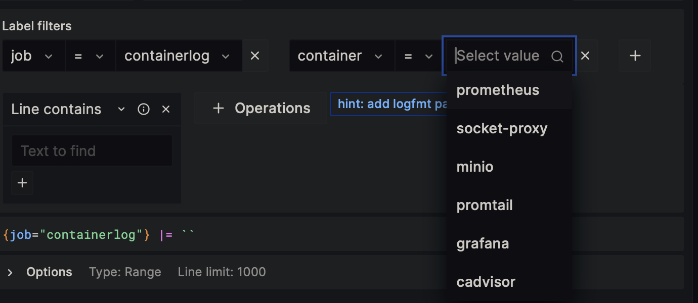

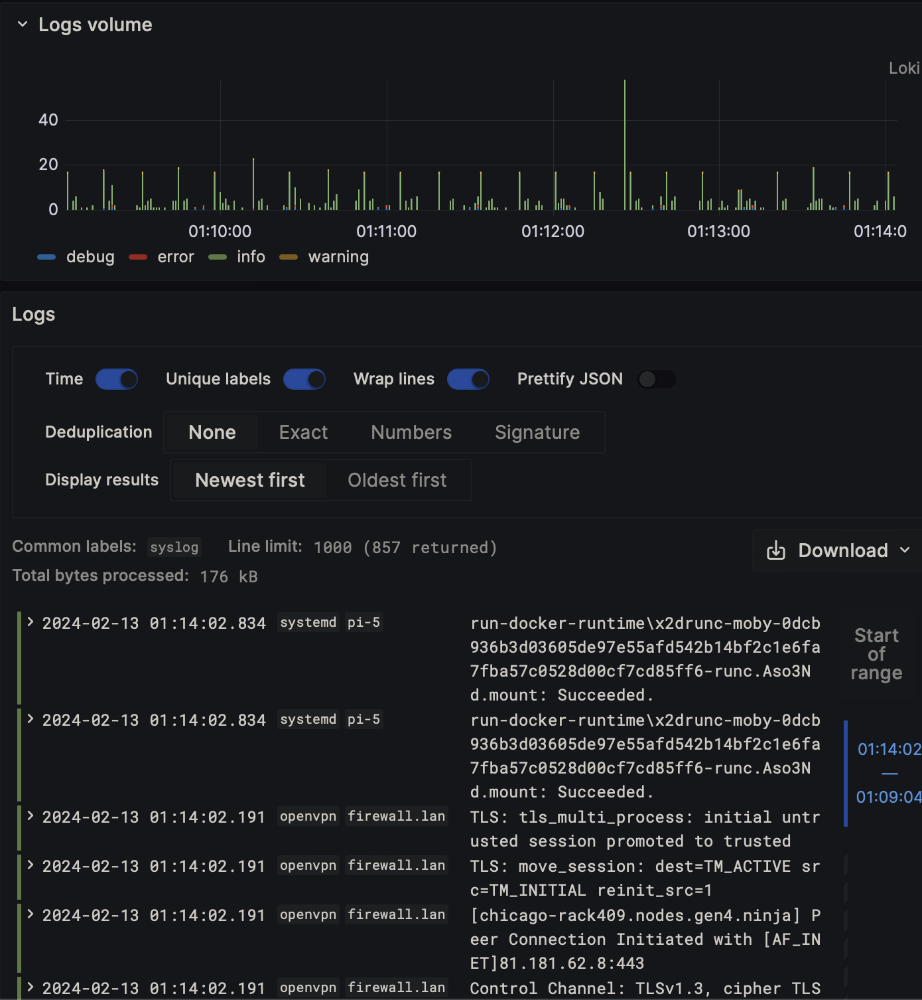

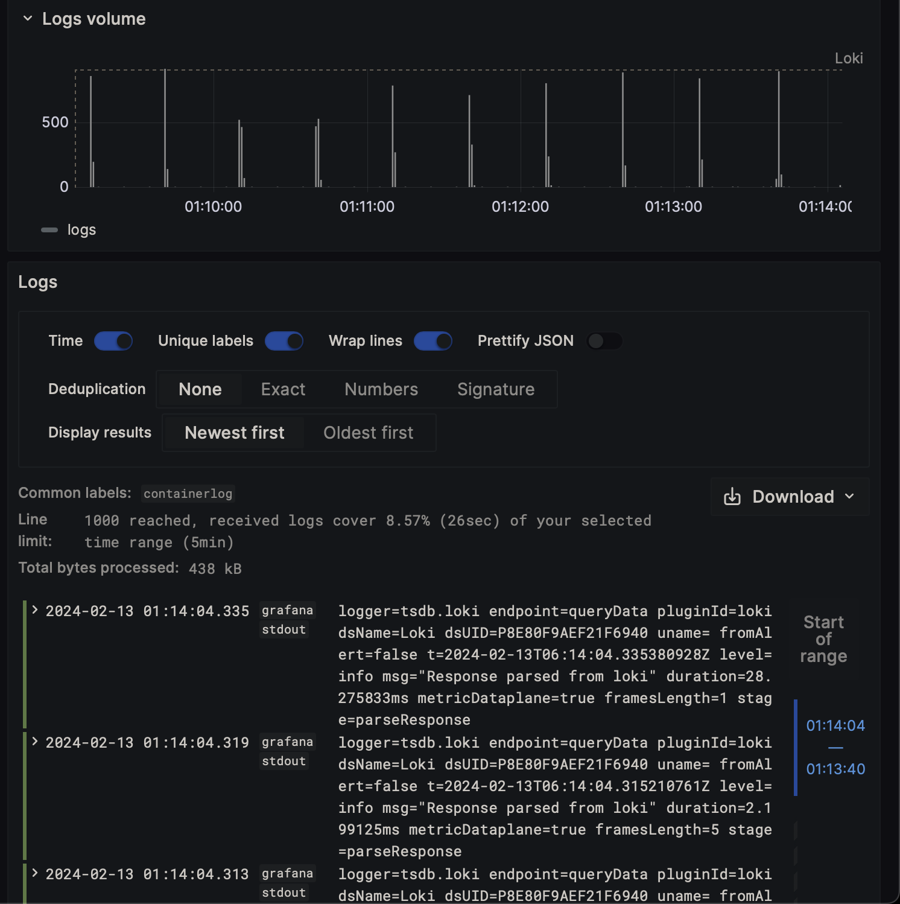

## Alerting

Monitor your services and get notified if something goes down.

```yml
services:
  uptime-kuma:
    image: 'louislam/uptime-kuma:1'
    container_name: uptime-kuma
    <<: *common
    volumes:
      - $DOCKER_DATA/uptime-kuma:/app/data
    ports:
      - 3001:3001
    environment:
      <<: *environment
```


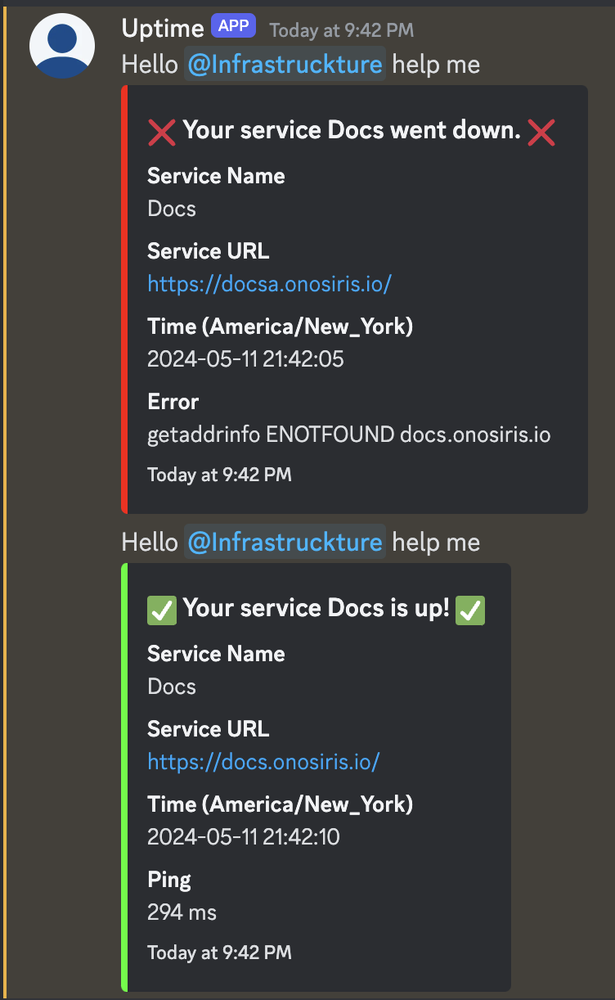

## Dashboard

Grafana Dashboard for displaying metrics and logs.

```yml
services:
  grafana:
    depends_on:
      - prometheus
      - loki
    image: grafana/grafana:latest
    container_name: grafana
    <<: *common
    volumes:
      - $DOCKER__CONFIG/grafana/provisioning/datasources:/etc/grafana/provisioning/datasources:ro
      - $DOCKER__CONFIG/grafana/provisioning/dashboards:/etc/grafana/provisioning/dashboards:ro
      - $DOCKER__CONFIG/grafana/dashboards:/var/lib/grafana/dashboards:ro
    ports:
      - 3000:3000
    environment:
      <<: *environment
      GF_AUTH_ANONYMOUS_ENABLED: "true"
      GF_AUTH_ANONYMOUS_ORG_ROLE: Admin
      GF_AUTH_BASIC_ENABLED: "false"
      GF_AUTH_DISABLE_LOGIN_FORM: "true"
      GF_DASHBOARDS_DEFAULT_HOME_DASHBOARD_PATH: /var/lib/grafana/dashboards/no_folder/syslog_overview.json
      GF_INSTALL_PLUGINS: "grafana-clock-panel,grafana-simple-json-datasource,grafana-worldmap-panel,grafana-piechart-panel,cloudflare-app"
```